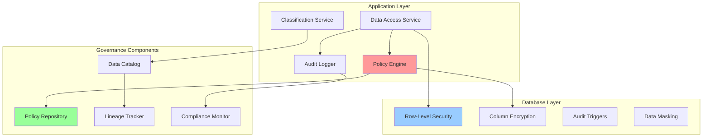

# ADR-004: Data Governance Framework

**Status:** Accepted  
**Date:** 2025-01-15  
**Deciders:** Architecture Team, Data Engineering Team, Compliance Team  
**Technical Story:** Establish comprehensive data governance framework for SCIRM's multi-tenant supply chain intelligence platform

## Context and Problem Statement

SCIRM processes sensitive supply chain data across multiple tenants, including:
- Supplier financial information and risk profiles
- Purchase order data with pricing and volume details
- Shipment tracking and logistics data
- Regulatory compliance documentation
- AI model training data and predictions

We need a robust data governance framework that ensures:
- Data privacy and security across tenant boundaries
- Regulatory compliance (GDPR, CCPA, SOX, FDA)
- Data quality and lineage tracking
- Audit trails for all data access and modifications
- Scalable data classification and retention policies

## Decision Drivers

- **Regulatory Compliance**: Must support GDPR, CCPA, SOX, FDA regulations
- **Multi-tenant Security**: Strict data isolation between organizations
- **Data Quality**: Ensure high-quality data for AI/ML model accuracy
- **Audit Requirements**: Complete audit trails for compliance and security
- **Scalability**: Framework must scale to 1000+ enterprise tenants
- **Performance**: Minimal impact on sub-500ms response time requirements

## Considered Options

### Option 1: Database-Level Governance (Row-Level Security)
**Approach**: Implement governance primarily through PostgreSQL RLS policies

**Pros:**
- Native database enforcement
- High performance with minimal overhead
- Automatic enforcement across all queries
- Leverages existing PostgreSQL security features

**Cons:**
- Limited flexibility for complex policies
- Difficult to implement cross-table governance rules
- Limited audit granularity
- Vendor lock-in to PostgreSQL

### Option 2: Application-Layer Governance Framework
**Approach**: Implement governance through application middleware and services

**Pros:**
- Maximum flexibility for complex policies
- Technology-agnostic implementation
- Rich audit and logging capabilities
- Easy integration with external compliance tools

**Cons:**
- Performance overhead on every data access
- Risk of bypass if not properly implemented
- Increased complexity and maintenance burden
- Potential for inconsistent enforcement

### Option 3: Hybrid Governance Model (Selected)
**Approach**: Combine database-level RLS with application-layer policy enforcement

**Pros:**
- Defense-in-depth security model
- Performance optimization through database enforcement
- Flexibility for complex business rules
- Comprehensive audit capabilities
- Gradual migration path

**Cons:**
- Increased complexity in policy management
- Potential for policy conflicts between layers
- Higher initial implementation cost

## Decision Outcome

**Chosen option: "Option 3: Hybrid Governance Model"**

### Decision Matrix

| Criteria | Weight | Option 1: DB-Only | Option 2: App-Only | Option 3: Hybrid |
|----------|--------|-------------------|--------------------|-----------------|
| **Security** | 25% | 7/10 | 8/10 | **9/10** |
| **Performance** | 20% | 9/10 | 6/10 | **8/10** |
| **Compliance** | 20% | 6/10 | 9/10 | **9/10** |
| **Flexibility** | 15% | 5/10 | 9/10 | **8/10** |
| **Maintainability** | 10% | 8/10 | 6/10 | **7/10** |
| **Scalability** | 10% | 8/10 | 7/10 | **8/10** |
| **Total Score** | 100% | **7.0** | **7.4** | **8.3** |

### Implementation Architecture

## Positive Consequences

- **Enhanced Security**: Multi-layer protection against data breaches
- **Regulatory Compliance**: Comprehensive framework supports all required regulations
- **Performance Optimization**: Database-level enforcement minimizes latency impact
- **Audit Excellence**: Complete data lineage and access tracking
- **Scalable Architecture**: Framework scales to enterprise requirements
- **Flexibility**: Application layer enables complex business rule implementation

## Negative Consequences

- **Implementation Complexity**: Requires coordination between database and application teams
- **Policy Management**: Need for sophisticated tooling to manage dual-layer policies
- **Initial Cost**: Higher upfront investment in governance infrastructure
- **Learning Curve**: Team needs training on hybrid governance model

## Implementation Plan

### Phase 1: Foundation (Q1 2025)
- Implement core RLS policies for tenant isolation
- Deploy basic application-layer policy engine
- Establish audit logging infrastructure
- Create data classification taxonomy

### Phase 2: Enhancement (Q2 2025)
- Advanced policy rules for PII and sensitive data
- Data lineage tracking implementation
- Compliance monitoring dashboard
- Automated policy testing framework

### Phase 3: Optimization (Q3 2025)
- Performance tuning and optimization
- Advanced analytics on governance metrics
- Integration with external compliance tools
- Self-service data governance portal

## Compliance Mapping

| Regulation | Requirement | Implementation |
|------------|-------------|----------------|
| **GDPR** | Right to be forgotten | Automated data deletion workflows |
| **GDPR** | Data portability | Standardized export APIs |
| **CCPA** | Data transparency | Data catalog with usage tracking |
| **SOX** | Financial data controls | Enhanced audit trails for financial data |
| **FDA** | Pharmaceutical traceability | Supply chain data lineage tracking |

## Monitoring and Metrics

- **Policy Violations**: <0.1% of data access attempts
- **Audit Completeness**: 100% of data access logged
- **Compliance Score**: >95% across all regulations
- **Performance Impact**: <10ms additional latency
- **Data Quality Score**: >98% accuracy in classification

## Related Decisions

- [ADR-001: Multi-Agent Swarm Architecture](ADR-001-multi-agent-swarm-architecture.md)
- [ADR-002: RAG Implementation Strategy](ADR-002-rag-implementation-strategy.md)
- [ADR-005: Branch Protection Strategy](ADR-005-branch-protection-strategy.md)
- [ADR-006: Internal Dashboard Isolation](ADR-006-internal-dashboard-isolation.md)

## References

- [SCIRM Database Architecture](../database.md)
- [Security Policies](../../security/cag-policies.md)
- [Compliance Documentation](../../compliance/documentation-policy.md)
- [GDPR Compliance Guide](https://gdpr.eu/)
- [PostgreSQL RLS Documentation](https://www.postgresql.org/docs/current/ddl-rowsecurity.html)
