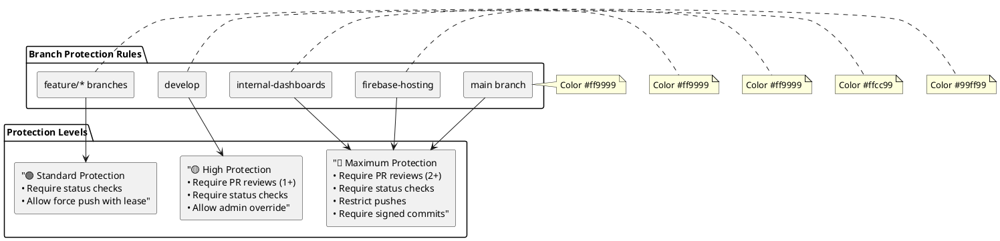

# ADR-005: Branch Protection Strategy

**Status:** Accepted  
**Date:** 2025-01-15  
**Deciders:** DevOps Team, Security Team, Engineering Leadership  
**Technical Story:** Establish comprehensive branch protection and deployment strategy for SCIRM's documentation and application code

## Context and Problem Statement

SCIRM requires a robust branch protection strategy that ensures:
- Documentation security and prevents accidental exposure of internal information
- Code quality through mandatory reviews and automated checks
- Deployment safety with proper staging and production controls
- Compliance with security policies and audit requirements
- Developer productivity while maintaining security standards

Specific challenges:
- Documentation contains both public-facing content and internal dashboards
- Multiple deployment targets (GitHub Pages, Firebase Hosting, internal systems)
- Need for emergency hotfix procedures while maintaining security
- Integration with CI/CD pipelines and quality gates

## Decision Drivers

- **Security**: Prevent unauthorized changes and information disclosure
- **Compliance**: Meet SOC2, GDPR, and internal audit requirements
- **Quality**: Ensure all changes pass automated tests and manual review
- **Deployment Safety**: Separate staging and production environments
- **Developer Experience**: Minimize friction while maintaining security
- **Emergency Response**: Enable rapid hotfixes when needed

## Considered Options

### Option 1: Single Branch with Environment Folders
**Approach**: Use main branch with separate folders for different environments

**Pros:**
- Simple branch structure
- Easy to understand and maintain
- Single source of truth
- Minimal merge conflicts

**Cons:**
- Risk of accidental deployment to wrong environment
- Difficult to implement environment-specific protections
- Limited ability to control access by environment
- Complex CI/CD logic required

### Option 2: Multi-Branch Strategy with Environment Branches
**Approach**: Separate branches for different environments and content types

**Pros:**
- Clear separation of environments
- Environment-specific protection rules
- Granular access control
- Safer deployment process

**Cons:**
- More complex branch management
- Potential for merge conflicts between branches
- Higher maintenance overhead
- Learning curve for developers

### Option 3: Hybrid Protection Model (Selected)
**Approach**: Combine main development branch with protected deployment branches

**Pros:**
- Balance of simplicity and security
- Clear deployment pipeline
- Environment isolation
- Flexible protection rules
- Emergency hotfix capability

**Cons:**
- Moderate complexity in branch management
- Requires discipline in following branching model
- Some overhead in maintaining multiple branches

## Decision Outcome

**Chosen option: "Option 3: Hybrid Protection Model"**

### Decision Matrix

| Criteria | Weight | Option 1: Single Branch | Option 2: Multi-Branch | Option 3: Hybrid |
|----------|--------|------------------------|------------------------|------------------|
| **Security** | 30% | 5/10 | 9/10 | **8/10** |
| **Simplicity** | 20% | 9/10 | 4/10 | **7/10** |
| **Deployment Safety** | 20% | 4/10 | 9/10 | **8/10** |
| **Developer Experience** | 15% | 8/10 | 5/10 | **7/10** |
| **Maintainability** | 10% | 7/10 | 5/10 | **7/10** |
| **Emergency Response** | 5% | 6/10 | 8/10 | **8/10** |
| **Total Score** | 100% | **6.4** | **7.0** | **7.6** |

### Branch Strategy Architecture


> **TODO**: This diagram requires manual conversion from Mermaid to PlantUML.
> See the PlantUML documentation for proper syntax.

```plantuml
@startuml
!theme plain
title Unknown Diagram Type (Conversion Required)

> **NOTE**: Unknown Mermaid diagram type.
> Manual conversion to PlantUML required.

rectangle "TODO: Convert to PlantUML" as TODO
@enduml
```

### Protection Rules by Branch



## Implementation Details

### Branch Purposes and Rules

| Branch | Purpose | Protection Level | Deployment Target |
|--------|---------|------------------|-------------------|
| `main` | Production-ready code | Maximum | Internal systems |
| `firebase-hosting` | Public documentation | Maximum | Firebase/GitHub Pages |
| `internal-dashboards` | Internal docs only | Maximum | Internal hosting |
| `develop` | Integration branch | High | Staging environment |
| `feature/*` | Feature development | Standard | Development |
| `hotfix/*` | Emergency fixes | High | Direct to main |

### Required Status Checks

```plantuml
@startuml
left to right direction
rectangle "Pull Request" as A
B  -->  C[Build Success]
B  -->  D[Tests Pass]
B  -->  E[Security Scan]
B  -->  F[Docs Build]
B  -->  G[Visual Validation]
C  -->  H[Manual Review]
D  -->  H
E  -->  H
F  -->  H
G  -->  H
H  -->  I[Merge Approval]
I  -->  J[Deploy]
note right of B : Color #e1f5fe
note right of H : Color #fff3e0
note right of I : Color #e8f5e8
@enduml
```

### Deployment Flow

1. **Development**: `feature/*` → `develop` → staging deployment
2. **Production**: `develop` → `main` → production deployment
3. **Documentation**: `main` → `firebase-hosting` → public docs
4. **Internal**: `main` → `internal-dashboards` → internal docs
5. **Hotfix**: `hotfix/*` → `main` → immediate deployment

## Positive Consequences

- **Enhanced Security**: Multi-layer protection prevents unauthorized changes
- **Clear Deployment Path**: Explicit branches for different deployment targets
- **Quality Assurance**: Mandatory reviews and automated checks
- **Audit Compliance**: Complete history and approval trails
- **Emergency Capability**: Hotfix process for critical issues
- **Content Isolation**: Separation of public and internal documentation

## Negative Consequences

- **Increased Complexity**: More branches to manage and understand
- **Merge Overhead**: Additional steps in deployment process
- **Learning Curve**: Team needs training on new branching model
- **Maintenance Burden**: Regular synchronization between branches required

## Implementation Plan

### Phase 1: Core Protection (Week 1)
- Configure branch protection rules for main, firebase-hosting, internal-dashboards
- Set up required status checks and review requirements
- Update CI/CD workflows for new branch strategy
- Create documentation for branching model

### Phase 2: Workflow Integration (Week 2)
- Implement automated deployment pipelines
- Configure environment-specific deployment rules
- Set up monitoring and alerting for failed deployments
- Train development team on new processes

### Phase 3: Advanced Features (Week 3-4)
- Implement emergency hotfix procedures
- Add automated branch synchronization
- Configure advanced security scanning
- Create self-service deployment dashboard

## Monitoring and Metrics

- **Protection Violations**: 0 unauthorized direct pushes to protected branches
- **Review Coverage**: 100% of changes reviewed before merge
- **Deployment Success**: >99% successful deployments
- **Hotfix Response**: <2 hours from issue to production fix
- **Security Incidents**: 0 accidental exposure of internal content

## Emergency Procedures

### Critical Security Issue
1. Create `hotfix/security-YYYY-MM-DD` branch from `main`
2. Implement minimal fix with security team review
3. Emergency merge with security team approval
4. Immediate deployment to all environments
5. Post-incident review and documentation update

### Documentation Exposure
1. Immediately revert problematic commit
2. Force push to remove from history if needed
3. Regenerate any exposed secrets or credentials
4. Conduct security assessment of exposed information
5. Update protection rules to prevent recurrence

## Related Decisions

- [ADR-003: Secure GitHub Pages Publishing](ADR-003-secure-github-pages-publishing.md)
- [ADR-004: Data Governance Framework](ADR-004-data-governance-framework.md)
- [ADR-006: Internal Dashboard Isolation](ADR-006-internal-dashboard-isolation.md)

## References

- [GitHub Branch Protection Documentation](https://docs.github.com/en/repositories/configuring-branches-and-merges-in-your-repository/defining-the-mergeability-of-pull-requests/about-protected-branches)
- [Git Flow Branching Model](https://nvie.com/posts/a-successful-git-branching-model/)
- [SCIRM Security Policies](../../security/security-overview.md)
- [CI/CD Workflow Documentation](../../development/contributing.md)
