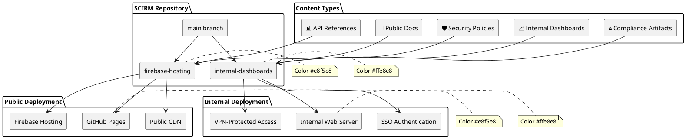
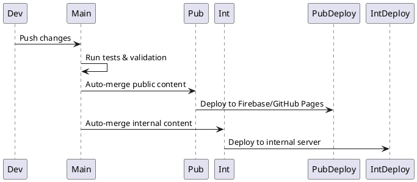

# ADR-006: Internal Dashboard Isolation

**Status:** Accepted  
**Date:** 2025-01-15  
**Deciders:** Security Team, DevOps Team, Compliance Team  
**Technical Story:** Implement secure isolation of internal dashboards and compliance documentation from public-facing content

## Context and Problem Statement

SCIRM's documentation system contains both public-facing content and sensitive internal information:
- **Public Content**: Product documentation, API references, user guides
- **Internal Content**: Compliance artifacts, internal dashboards, security policies, audit reports

Challenges:
- Risk of accidentally exposing internal information through public documentation sites
- Need for internal teams to access dashboards and compliance data
- Regulatory requirements for audit trail separation
- Different access control requirements for internal vs external users
- CI/CD pipeline complexity with multiple deployment targets

## Decision Drivers

- **Security**: Prevent accidental exposure of sensitive internal information
- **Compliance**: Meet SOC2, GDPR audit requirements for data separation
- **Access Control**: Different authentication/authorization for internal content
- **Operational Efficiency**: Internal teams need easy access to dashboards
- **Deployment Safety**: Separate CI/CD pipelines to prevent cross-contamination
- **Audit Trail**: Clear separation of public and internal content changes

## Considered Options

### Option 1: Single Repository with Access Controls
**Approach**: Use folder-based separation with GitHub access controls

**Pros:**
- Single repository to manage
- Unified CI/CD pipeline
- Easy cross-referencing between content
- Simple developer workflow

**Cons:**
- High risk of accidental exposure
- Complex CI/CD logic to separate content
- Difficult to implement different authentication
- Limited audit trail separation

### Option 2: Separate Repositories
**Approach**: Split public and internal content into different repositories

**Pros:**
- Complete isolation of content
- Independent access controls
- Separate CI/CD pipelines
- Clear audit boundaries

**Cons:**
- Duplication of shared content
- Complex cross-repository references
- Higher maintenance overhead
- Difficult to keep common elements synchronized

### Option 3: Branch-Based Isolation (Selected)
**Approach**: Use separate branches with different deployment targets

**Pros:**
- Single repository with clear separation
- Independent deployment pipelines
- Shared common content and tooling
- Flexible access control by branch
- Clear audit trails per branch

**Cons:**
- Branch management complexity
- Risk of accidental merges
- Need for careful CI/CD configuration
- Developer training required

## Decision Outcome

**Chosen option: "Option 3: Branch-Based Isolation"**

### Decision Matrix

| Criteria | Weight | Option 1: Access Controls | Option 2: Separate Repos | Option 3: Branch Isolation |
|----------|--------|---------------------------|--------------------------|----------------------------|
| **Security** | 30% | 4/10 | 10/10 | **8/10** |
| **Maintainability** | 20% | 8/10 | 4/10 | **7/10** |
| **Deployment Safety** | 20% | 3/10 | 9/10 | **8/10** |
| **Developer Experience** | 15% | 9/10 | 5/10 | **7/10** |
| **Audit Compliance** | 10% | 5/10 | 9/10 | **8/10** |
| **Operational Efficiency** | 5% | 7/10 | 6/10 | **8/10** |
| **Total Score** | 100% | **5.8** | **7.4** | **7.7** |

### Isolation Architecture



## Implementation Details

### Branch Strategy

| Branch | Content Type | Deployment Target | Access Level |
|--------|--------------|-------------------|-------------|
| `firebase-hosting` | Public documentation | Firebase/GitHub Pages | Public |
| `internal-dashboards` | Internal content | Internal web server | VPN + SSO |
| `main` | Source of truth | No direct deployment | Team access |

### Content Classification

```plantuml
@startuml
rectangle "Content Creation" as A
B  --> |Public| C[Public Documentation]
B  --> |Internal| D[Internal Content]
C  -->  E[docs/]
C  -->  F[api/]
C  -->  G[guides/]
D  -->  H[compliance/]
D  -->  I[dashboards/]
D  -->  J[security/]
D  -->  K[audit/]
E  -->  L[firebase-hosting branch]
F  -->  L
G  -->  L
H  -->  M[internal-dashboards branch]
I  -->  M
J  -->  M
K  -->  M
L  -->  N[Public Deployment]
M  -->  O[Internal Deployment]
note right of C : Color #e8f5e8
note right of D : Color #ffe8e8
note right of N : Color #e8f5e8
note right of O : Color #ffe8e8
@enduml
```

### Deployment Pipeline



## Security Controls

### Content Sanitization

- **Automated Scanning**: Remove internal links and references from public content
- **Keyword Filtering**: Block sensitive terms from public deployment
- **Path Validation**: Ensure internal paths don't appear in public builds
- **Reference Checking**: Validate all cross-references stay within appropriate domains

### Access Controls

| Environment | Authentication | Authorization | Network Access |
|-------------|----------------|---------------|----------------|
| **Public** | None | Public read | Internet |
| **Internal** | SSO Required | Role-based | VPN + Corporate network |

### Audit Trail

```plantuml
@startuml
left to right direction
rectangle "Content Change" as A
B  -->  C[Branch Detection]
C  -->  D[Audit Log Entry]
D  -->  E[Compliance Database]
rectangle "Deployment" as F
G  -->  H[Access Tracking]
H  -->  E
rectangle "User Access" as I
J  -->  K[Authorization Check]
K  -->  E
note right of E : Color #fff3cd
@enduml
```

## Positive Consequences

- **Security Enhancement**: Clear separation prevents accidental exposure
- **Compliance Alignment**: Meets audit requirements for content isolation
- **Operational Clarity**: Teams know exactly where to find relevant content
- **Deployment Safety**: Independent pipelines reduce cross-contamination risk
- **Audit Trail**: Complete tracking of public vs internal content changes
- **Scalability**: Model scales to additional content types and environments

## Negative Consequences

- **Branch Complexity**: Additional branches to manage and synchronize
- **Developer Training**: Team needs education on content classification
- **CI/CD Overhead**: More complex deployment logic and monitoring
- **Potential Conflicts**: Risk of merge conflicts between branches
- **Maintenance Burden**: Regular synchronization and validation required

## Implementation Plan

### Phase 1: Infrastructure Setup (Week 1)
- Create `internal-dashboards` branch with protection rules
- Configure separate deployment pipelines
- Implement content sanitization tools
- Set up internal web server with SSO

### Phase 2: Content Migration (Week 2)
- Audit existing content for classification
- Move internal content to appropriate locations
- Update cross-references and navigation
- Test deployment pipelines

### Phase 3: Validation & Training (Week 3)
- Comprehensive testing of both deployment paths
- Security review and penetration testing
- Team training on new content workflow
- Documentation and runbook creation

### Phase 4: Monitoring & Optimization (Week 4)
- Implement monitoring and alerting
- Performance optimization
- Feedback collection and process refinement
- Compliance validation

## Monitoring and Metrics

- **Exposure Incidents**: 0 accidental exposure of internal content
- **Access Compliance**: 100% of internal access through proper authentication
- **Deployment Success**: >99% successful deployments to both environments
- **Content Classification**: >95% accuracy in automated classification
- **Audit Coverage**: 100% of content changes tracked and logged

## Emergency Procedures

### Accidental Internal Content Exposure
1. **Immediate Response**: Take down public site if internal content detected
2. **Assessment**: Determine scope and sensitivity of exposed information
3. **Remediation**: Remove content from public repositories and CDN caches
4. **Notification**: Alert security team and affected stakeholders
5. **Investigation**: Root cause analysis and process improvement

### Internal Site Compromise
1. **Isolation**: Disconnect internal server from network
2. **Assessment**: Determine extent of compromise and data access
3. **Recovery**: Restore from clean backup and patch vulnerabilities
4. **Monitoring**: Enhanced monitoring for suspicious activity
5. **Review**: Security review and access control updates

## Related Decisions

- [ADR-003: Secure GitHub Pages Publishing](ADR-003-secure-github-pages-publishing.md)
- [ADR-004: Data Governance Framework](ADR-004-data-governance-framework.md)
- [ADR-005: Branch Protection Strategy](ADR-005-branch-protection-strategy.md)

## References

- [SCIRM Security Policies](../../security/security-overview.md)
- [Compliance Documentation](../../compliance/documentation-policy.md)
- [GitHub Branch Protection](https://docs.github.com/en/repositories/configuring-branches-and-merges-in-your-repository/defining-the-mergeability-of-pull-requests/about-protected-branches)
- [Firebase Hosting Security](https://firebase.google.com/docs/hosting/security)
- [Security Overview](../../security/security-overview.md)
