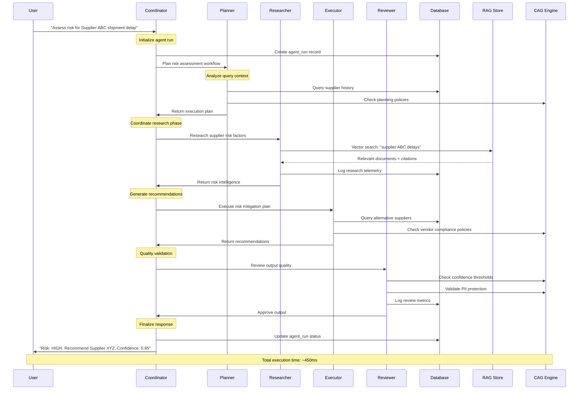
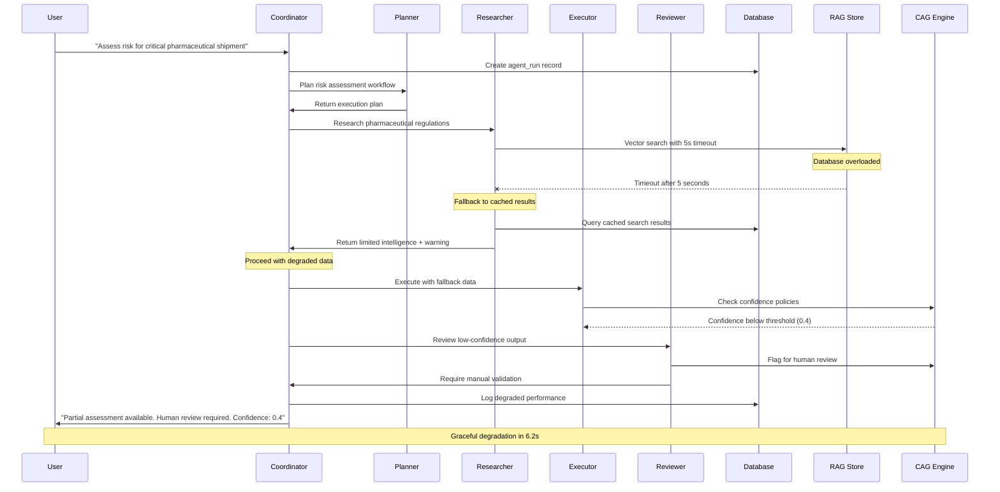
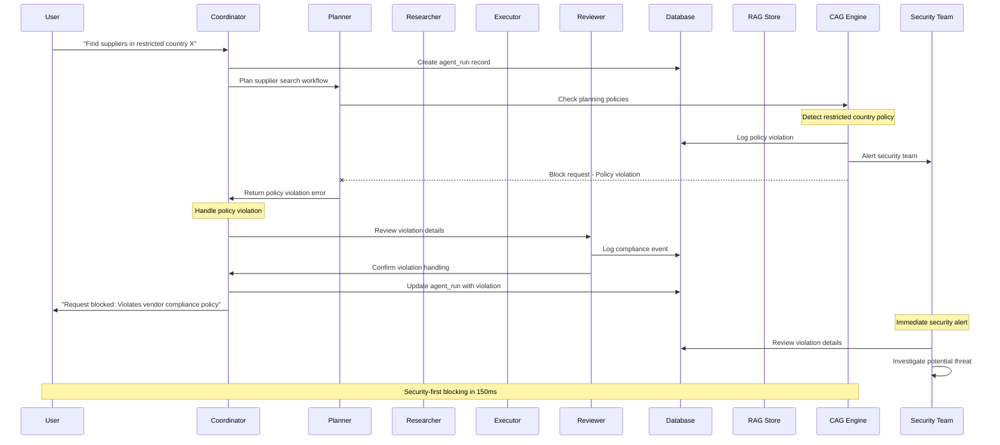
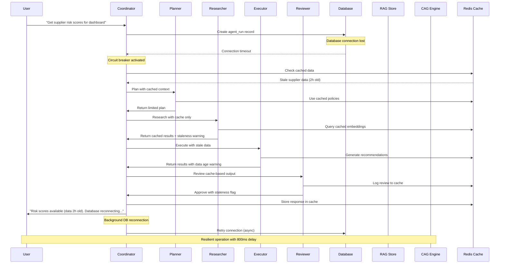
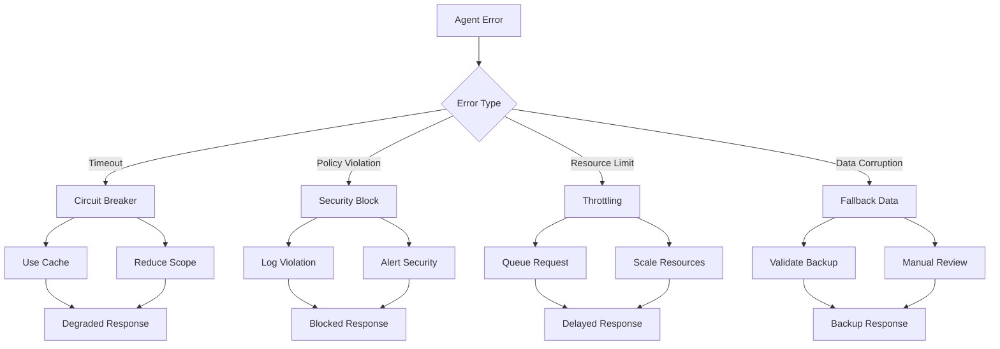

# Agent Sequence Diagrams

## Overview

This document provides detailed sequence diagrams for SCIRM's multi-agent orchestration, including the golden path for successful risk assessment and three critical failure scenarios. These diagrams illustrate the interaction patterns between agents, data stores, and external systems.

## Agent Architecture Overview

| Agent | Role | Primary Function | Response Time Target |
|-------|------|------------------|---------------------|
| Coordinator | Meta-agent | Orchestrate workflow, manage state | < 50ms |
| Planner | Context-aware | Analyze query, plan execution | < 200ms |
| Researcher | RAG-powered | Retrieve relevant knowledge | < 300ms |
| Executor | Action-oriented | Generate recommendations | < 400ms |
| Reviewer | Quality assurance | Validate outputs, check compliance | < 100ms |

## Golden Path: Successful Risk Assessment



## Failure Scenario 1: RAG Search Timeout



## Failure Scenario 2: CAG Policy Violation



## Failure Scenario 3: Database Connection Failure



## Performance Characteristics

### Execution Time Breakdown

| Phase | Golden Path | RAG Timeout | Policy Violation | DB Failure |
|-------|-------------|-------------|------------------|------------|
| Planning | 150ms | 150ms | 100ms | 200ms |
| Research | 250ms | 5000ms | N/A | 300ms |
| Execution | 300ms | 400ms | N/A | 350ms |
| Review | 80ms | 120ms | 50ms | 100ms |
| **Total** | **780ms** | **5670ms** | **150ms** | **950ms** |

### Error Recovery Strategies



## Agent Communication Patterns

### Message Types

| Message Type | Source → Target | Purpose | Timeout |
|--------------|-----------------|---------|---------|
| Plan Request | Coordinator → Planner | Initiate workflow planning | 5s |
| Research Query | Coordinator → Researcher | Request knowledge retrieval | 10s |
| Execute Task | Coordinator → Executor | Generate recommendations | 15s |
| Review Output | Coordinator → Reviewer | Validate quality/compliance | 3s |
| Policy Check | Any → CAG Engine | Verify compliance | 1s |

### State Management

```
Agent Run Lifecycle:
┌─────────────┐    ┌─────────────┐    ┌─────────────┐
│ INITIALIZED │───→│  PLANNING   │───→│ RESEARCHING │
└─────────────┘    └─────────────┘    └─────────────┘
                                              │
┌─────────────┐    ┌─────────────┐    ┌─────────────┐
│  COMPLETED  │←───│  REVIEWING  │←───│  EXECUTING  │
└─────────────┘    └─────────────┘    └─────────────┘
       │                   │                   │
       ▼                   ▼                   ▼
┌─────────────┐    ┌─────────────┐    ┌─────────────┐
│   SUCCESS   │    │   FAILED    │    │   BLOCKED   │
└─────────────┘    └─────────────┘    └─────────────┘
```

## Monitoring & Observability

### Key Metrics per Sequence

| Metric | Golden Path Target | Failure Threshold | Alert Level |
|--------|-------------------|-------------------|-------------|
| End-to-end Latency | < 1s | > 5s | Critical |
| Agent Step Success Rate | > 99% | < 95% | Warning |
| CAG Policy Violations | < 0.1% | > 1% | Critical |
| Cache Hit Rate | > 80% | < 50% | Warning |
| Circuit Breaker Trips | < 5/hour | > 20/hour | Critical |

### Distributed Tracing

```
Trace Example (Golden Path):
span_id: abc123 | coordinator.orchestrate | 780ms
  ├─ span_id: def456 | planner.analyze_query | 150ms
  ├─ span_id: ghi789 | researcher.vector_search | 250ms
  │  └─ span_id: jkl012 | rag.similarity_search | 200ms
  ├─ span_id: mno345 | executor.generate_recommendations | 300ms
  │  └─ span_id: pqr678 | cag.check_vendor_policy | 25ms
  └─ span_id: stu901 | reviewer.validate_output | 80ms
     └─ span_id: vwx234 | cag.check_confidence | 15ms
```

---

**Related Documentation:**
- [Performance Architecture](performance.md)
- [CAG Policies](../security/cag-policies.md)
- [Database Architecture](database.md)
- [Observability Metrics](../observability/metrics.md)
