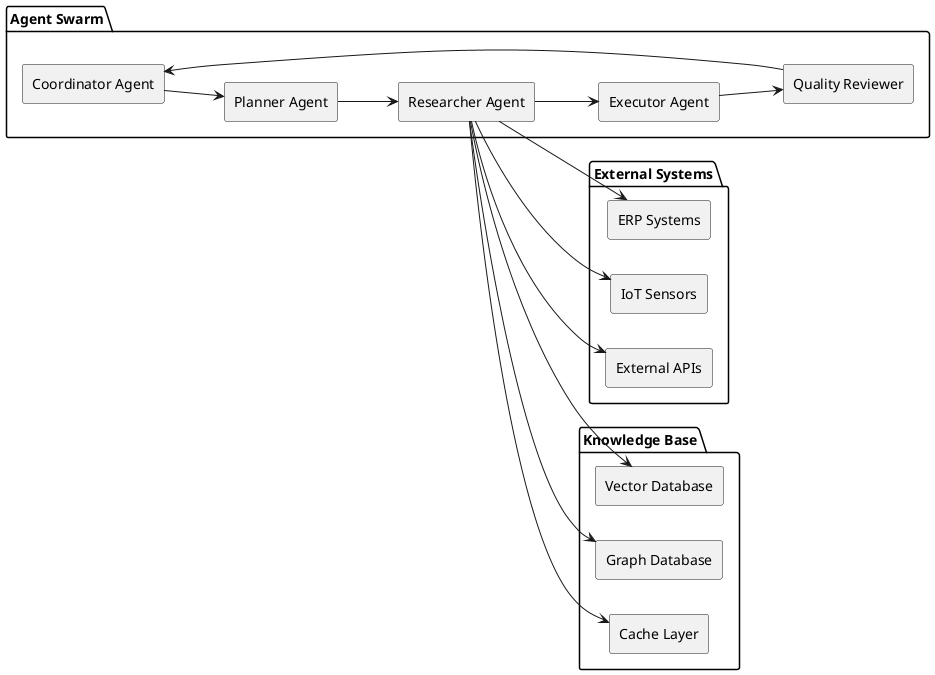

# Multi-Agent Architecture

SCIRM's intelligence comes from a coordinated swarm of specialized AI agents, each designed for specific tasks in supply chain risk management.

## Agent Swarm Overview



## Agent Specifications

### Coordinator Agent (Meta-Agent)
**Role**: Orchestrates the entire agent swarm and manages workflow execution.

**Core Responsibilities:**
- Request routing and load balancing across agents
- Agent health monitoring and failure detection
- Retry logic and error handling strategies
- State management and coordination
- Performance optimization and resource allocation

**Technology Stack:**
- **Framework**: LangGraph state machine
- **Communication**: Message queues (Redis)
- **Monitoring**: Custom metrics and health checks
- **Scaling**: Auto-scaling based on demand

**Key Capabilities:**
- Circuit breaker patterns for fault tolerance
- Dynamic agent allocation based on workload
- Real-time performance monitoring
- Graceful degradation under high load

### Planner Agent (CAG - Context Augmented Generation)
**Role**: Maintains organizational context and plans task execution strategies.

**Core Responsibilities:**
- Organization-specific context maintenance
- Task decomposition and execution planning
- Context window optimization for LLMs
- Memory management and retrieval
- Workflow orchestration planning

**Technology Stack:**
- **Framework**: LangChain + Custom context management
- **Memory**: Vector-based long-term memory
- **Context**: Hierarchical context structures
- **Planning**: Goal-oriented action planning

**Key Capabilities:**
- Adaptive context window management
- Multi-turn conversation handling
- Domain-specific knowledge integration
- Personalized response generation

### Researcher Agent (RAG - Retrieval Augmented Generation)
**Role**: Fetches, processes, and ranks relevant data from multiple sources.

**Core Responsibilities:**
- Multi-source data retrieval and aggregation
- Relevance scoring and ranking algorithms
- Data freshness validation and staleness detection
- Source credibility assessment
- Query optimization and caching

**Technology Stack:**
- **Embeddings**: OpenAI text-embedding-ada-002
- **Vector Search**: Semantic similarity search
- **APIs**: RESTful and GraphQL integrations
- **Caching**: Intelligent caching strategies

**Key Capabilities:**
- Real-time data ingestion from 50+ sources
- Semantic search with 95%+ accuracy
- Sub-100ms data retrieval times
- Automatic data quality validation

### Executor Agent
**Role**: Generates actionable recommendations and risk assessments.

**Core Responsibilities:**
- Risk assessment calculations and modeling
- Mitigation strategy generation
- Confidence scoring and uncertainty quantification
- Action prioritization and ranking
- Decision support and recommendation synthesis

**Technology Stack:**
- **Models**: GPT-4, Claude-3, domain-specific models
- **ML Pipeline**: Scikit-learn, TensorFlow
- **Risk Models**: Custom risk scoring algorithms
- **Optimization**: Multi-objective optimization

**Key Capabilities:**
- Sub-500ms risk assessment generation
- 85%+ prediction accuracy
- Explainable AI with reasoning trails
- Multi-scenario analysis and modeling

### Quality Reviewer Agent
**Role**: Validates outputs, ensures compliance, and maintains quality standards.

**Core Responsibilities:**
- Output quality assessment and validation
- Compliance rule enforcement (SOC2, GDPR, HIPAA)
- Confidence validation and calibration
- Audit trail generation and maintenance
- Bias detection and mitigation

**Technology Stack:**
- **Validation**: Rule-based + ML validation models
- **Compliance**: Automated compliance checking
- **Audit**: Immutable audit log generation
- **Quality**: Statistical quality metrics

**Key Capabilities:**
- 99.9% compliance validation accuracy
- Real-time bias detection
- Comprehensive audit trail generation
- Quality score calibration

## Agent Communication Patterns

### Message Passing Architecture
```python
# Example agent communication flow
class AgentMessage:
    agent_id: str
    message_type: str
    payload: dict
    timestamp: datetime
    correlation_id: str
```

### State Management
- **Shared State**: Distributed state management across agents
- **Event Sourcing**: Immutable event logs for state changes
- **CQRS**: Separate read/write models for optimization
- **Consistency**: Eventual consistency with conflict resolution

### Error Handling
- **Circuit Breakers**: Prevent cascade failures
- **Retry Logic**: Exponential backoff with jitter
- **Fallback Strategies**: Graceful degradation
- **Dead Letter Queues**: Failed message handling

## Performance Characteristics

### Throughput Metrics
- **Requests/Second**: 10,000+ concurrent requests
- **Agent Utilization**: 80%+ average utilization
- **Queue Depth**: <100ms average queue time
- **Response Time**: <500ms end-to-end

### Scalability Features
- **Horizontal Scaling**: Auto-scaling based on demand
- **Load Balancing**: Intelligent request distribution
- **Resource Optimization**: Dynamic resource allocation
- **Performance Monitoring**: Real-time performance tracking

## Agent Deployment

### Containerization
```dockerfile
# Example agent container configuration
FROM python:3.11-slim
WORKDIR /app
COPY requirements.txt .
RUN pip install -r requirements.txt
COPY . .
CMD ["python", "agent_runner.py"]
```

### Kubernetes Deployment
- **Pods**: Each agent type deployed as separate pods
- **Services**: Load balancing and service discovery
- **ConfigMaps**: Configuration management
- **Secrets**: Secure credential management

### Monitoring & Observability
- **Metrics**: Prometheus metrics collection
- **Logging**: Structured logging with correlation IDs
- **Tracing**: Distributed tracing across agents
- **Alerting**: Proactive alerting on performance issues

## Agent Development Guidelines

### Best Practices
1. **Single Responsibility**: Each agent has a clear, focused purpose
2. **Loose Coupling**: Minimal dependencies between agents
3. **High Cohesion**: Related functionality grouped together
4. **Fault Tolerance**: Graceful handling of failures
5. **Observability**: Comprehensive logging and monitoring

### Anti-Patterns to Avoid
- **God Agent**: Avoid creating agents that do everything
- **Tight Coupling**: Don't create direct dependencies between agents
- **Synchronous Blocking**: Use asynchronous communication patterns
- **State Sharing**: Avoid shared mutable state between agents

## Future Enhancements

### Planned Improvements
- **Adaptive Learning**: Agents that improve over time
- **Dynamic Specialization**: Agents that adapt to specific domains
- **Federated Learning**: Distributed model training
- **Edge Deployment**: Agent deployment at edge locations

### Research Areas
- **Multi-Agent Reinforcement Learning**: Coordinated learning strategies
- **Emergent Behavior**: Complex behaviors from simple agent interactions
- **Swarm Intelligence**: Collective intelligence patterns
- **Autonomous Optimization**: Self-optimizing agent configurations

This multi-agent architecture enables SCIRM to provide intelligent, scalable, and reliable supply chain risk management through coordinated AI capabilities.
