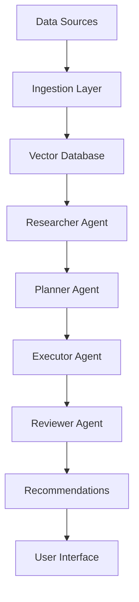

# Data Flows

This document describes how data flows through the SCIRM platform, from ingestion to actionable insights.

## Data Sources

### Internal Systems
- **ERP Systems**: SAP, Oracle, Microsoft Dynamics
- **Warehouse Management (WMS)**: Inventory levels, stock movements
- **Transportation Management (TMS)**: Shipment tracking, carrier performance
- **IoT Sensors**: Temperature, humidity, location tracking

### External Data Feeds
- **Weather Services**: Climate data affecting transportation and storage
- **Logistics APIs**: Carrier status, port congestion, shipping delays
- **Regulatory Feeds**: FDA alerts, customs regulations, trade restrictions
- **Market Data**: Commodity prices, currency fluctuations

## Data Processing Pipeline

### 1. Data Ingestion
- Real-time streaming via Apache Kafka
- Batch processing for historical data
- API integrations with external sources
- Data validation and quality checks

### 2. Data Transformation
- Normalization and standardization
- Entity resolution and deduplication
- Feature engineering for ML models
- Vector embedding generation

### 3. Storage & Indexing
- **Vector Database**: Pinecone/Weaviate for semantic search
- **Time Series**: InfluxDB for sensor data
- **Graph Database**: Neo4j for supply chain relationships
- **Document Store**: Elasticsearch for full-text search

### 4. AI Processing
- **Context Retrieval**: RAG queries against vector database
- **Risk Assessment**: ML models analyzing patterns
- **Recommendation Generation**: Multi-agent collaboration
- **Confidence Scoring**: Uncertainty quantification

## Agent Data Flow

## Data Governance

### Privacy & Security
- Data encryption at rest and in transit
- PII anonymization and pseudonymization
- Access controls based on data sensitivity
- Audit logging for all data access

### Compliance
- GDPR right to deletion implementation
- HIPAA safeguards for healthcare data
- SOC2 controls for data processing
- Retention policies by data type

### Quality Assurance
- Data lineage tracking
- Automated quality monitoring
- Anomaly detection and alerting
- Manual validation workflows
