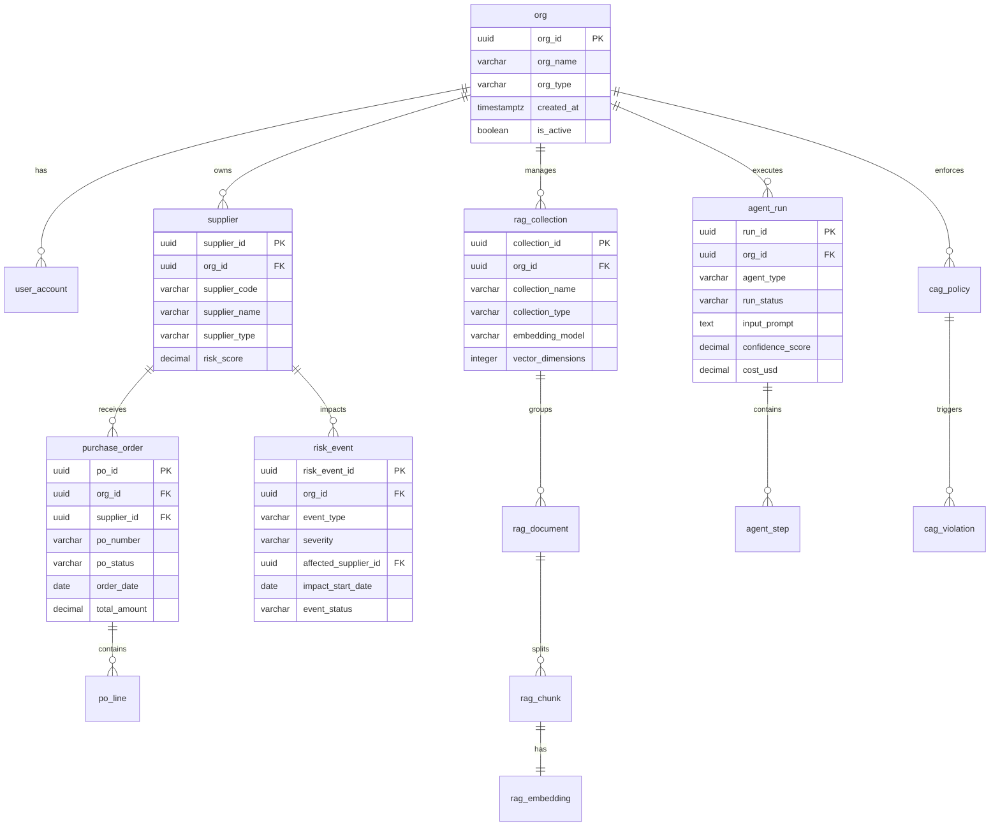
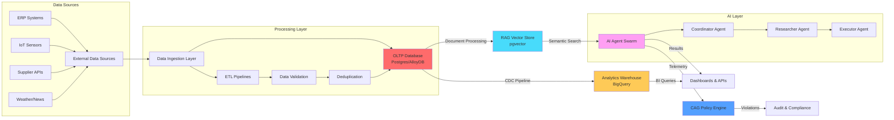

# SCIRM Database Architecture

**Version:** v1.0.0  
**Date:** 2025-08-23  
**Owner:** Data Architecture Team  
**Status:** Active

## Introduction

The SCIRM database architecture implements a multi-tier data strategy designed to support AI-powered supply chain risk management at enterprise scale. The architecture separates concerns across four distinct layers to optimize for different access patterns, performance requirements, and governance needs.

### Purpose of the Database in SCIRM

SCIRM's database serves as the foundational data layer for:
- **Real-time operational data** for supply chain transactions and risk events
- **Knowledge retrieval** for AI agents through vector embeddings and semantic search
- **Context-aware guardrails** for AI safety and compliance enforcement
- **Analytics and reporting** for business intelligence and performance monitoring

### Why 3 Tiers: OLTP, RAG/Vector, Analytics

1. **OLTP (Online Transaction Processing)**: High-frequency, low-latency transactional operations
2. **RAG/Vector Storage**: Semantic search and knowledge retrieval for AI agents
3. **Analytics**: Historical analysis, aggregations, and business intelligence queries

This separation ensures optimal performance for each use case while maintaining data consistency and governance.

### Supported Environments

- **Development**: Single-node Postgres with limited data for rapid iteration
- **Staging**: Multi-AZ AlloyDB with production-like data volumes for testing
- **Production**: Multi-region AlloyDB with read replicas and disaster recovery

## OLTP Schema (Postgres/AlloyDB)

The OLTP layer handles all transactional operations for supply chain management, user management, and real-time risk assessment.

### Schema Overview

| Layer | Purpose | Technology | Performance Target |
|-------|---------|------------|-------------------|
| OLTP | Transactional operations | Postgres/AlloyDB | < 50ms CRUD |
| RAG/Vector | Semantic search | pgvector | < 100ms similarity |
| CAG/Telemetry | AI governance | JSONB + indexes | < 25ms policy check |
| Analytics | Business intelligence | BigQuery | < 5s aggregations |

### Core Entities & Tables

#### Organization & User Management

```sql
-- Organizations (multi-tenant root)
CREATE TABLE org (
    org_id UUID PRIMARY KEY DEFAULT gen_random_uuid(),
    org_name VARCHAR(255) NOT NULL,
    org_type VARCHAR(50) NOT NULL CHECK (org_type IN ('pharma', 'manufacturer', 'distributor')),
    created_at TIMESTAMPTZ DEFAULT NOW(),
    updated_at TIMESTAMPTZ DEFAULT NOW(),
    is_active BOOLEAN DEFAULT true
);

-- Users with RBAC
CREATE TABLE user_account (
    user_id UUID PRIMARY KEY DEFAULT gen_random_uuid(),
    org_id UUID NOT NULL REFERENCES org(org_id),
    email VARCHAR(320) UNIQUE NOT NULL,
    role VARCHAR(50) NOT NULL CHECK (role IN ('admin', 'manager', 'analyst', 'viewer')),
    created_at TIMESTAMPTZ DEFAULT NOW(),
    last_login TIMESTAMPTZ,
    is_active BOOLEAN DEFAULT true
);
```

#### Supply Chain Entities

```sql
-- Suppliers
CREATE TABLE supplier (
    supplier_id UUID PRIMARY KEY DEFAULT gen_random_uuid(),
    org_id UUID NOT NULL REFERENCES org(org_id),
    supplier_code VARCHAR(50) NOT NULL,
    supplier_name VARCHAR(255) NOT NULL,
    supplier_type VARCHAR(50) NOT NULL,
    country_code CHAR(2) NOT NULL,
    risk_score DECIMAL(5,2) CHECK (risk_score >= 0 AND risk_score <= 100),
    created_at TIMESTAMPTZ DEFAULT NOW(),
    UNIQUE(org_id, supplier_code)
);

-- Purchase Orders
CREATE TABLE purchase_order (
    po_id UUID PRIMARY KEY DEFAULT gen_random_uuid(),
    org_id UUID NOT NULL REFERENCES org(org_id),
    po_number VARCHAR(50) NOT NULL,
    supplier_id UUID NOT NULL REFERENCES supplier(supplier_id),
    po_status VARCHAR(20) NOT NULL,
    order_date DATE NOT NULL,
    total_amount DECIMAL(15,2),
    created_at TIMESTAMPTZ DEFAULT NOW(),
    UNIQUE(org_id, po_number)
);

-- Risk Events
CREATE TABLE risk_event (
    risk_event_id UUID PRIMARY KEY DEFAULT gen_random_uuid(),
    org_id UUID NOT NULL REFERENCES org(org_id),
    event_type VARCHAR(50) NOT NULL,
    severity VARCHAR(10) NOT NULL,
    event_title VARCHAR(255) NOT NULL,
    affected_supplier_id UUID REFERENCES supplier(supplier_id),
    impact_start_date DATE,
    event_status VARCHAR(20) NOT NULL,
    detected_at TIMESTAMPTZ DEFAULT NOW()
);
```

### Multi-tenant Handling

All tables include `org_id` for tenant isolation with Row-Level Security (RLS):

```sql
ALTER TABLE supplier ENABLE ROW LEVEL SECURITY;
CREATE POLICY supplier_tenant_isolation ON supplier
    FOR ALL TO app_role
    USING (org_id = current_setting('app.current_org_id')::UUID);
```

## RAG & Vector Storage

The RAG layer provides semantic search using pgvector for AI agent knowledge retrieval.

### RAG Schema Design

```sql
-- RAG Collections
CREATE TABLE rag_collection (
    collection_id UUID PRIMARY KEY DEFAULT gen_random_uuid(),
    org_id UUID NOT NULL REFERENCES org(org_id),
    collection_name VARCHAR(255) NOT NULL,
    collection_type VARCHAR(50) NOT NULL,
    embedding_model VARCHAR(100) NOT NULL DEFAULT 'text-embedding-3-small',
    vector_dimensions INTEGER NOT NULL DEFAULT 1536,
    created_at TIMESTAMPTZ DEFAULT NOW(),
    UNIQUE(org_id, collection_name)
);

-- RAG Documents
CREATE TABLE rag_document (
    document_id UUID PRIMARY KEY DEFAULT gen_random_uuid(),
    collection_id UUID NOT NULL REFERENCES rag_collection(collection_id),
    document_name VARCHAR(255) NOT NULL,
    content_hash VARCHAR(64) NOT NULL,
    processing_status VARCHAR(20) NOT NULL,
    created_at TIMESTAMPTZ DEFAULT NOW()
);

-- RAG Chunks
CREATE TABLE rag_chunk (
    chunk_id UUID PRIMARY KEY DEFAULT gen_random_uuid(),
    document_id UUID NOT NULL REFERENCES rag_document(document_id),
    chunk_text TEXT NOT NULL,
    chunk_metadata JSONB,
    chunk_order INTEGER NOT NULL,
    created_at TIMESTAMPTZ DEFAULT NOW()
);

-- RAG Embeddings
CREATE TABLE rag_embedding (
    embedding_id UUID PRIMARY KEY DEFAULT gen_random_uuid(),
    chunk_id UUID NOT NULL REFERENCES rag_chunk(chunk_id),
    embedding vector(1536) NOT NULL,
    created_at TIMESTAMPTZ DEFAULT NOW()
);

-- RAG Citations
CREATE TABLE rag_citation (
    citation_id UUID PRIMARY KEY DEFAULT gen_random_uuid(),
    agent_run_id UUID NOT NULL,
    chunk_id UUID NOT NULL REFERENCES rag_chunk(chunk_id),
    relevance_score DECIMAL(5,4),
    created_at TIMESTAMPTZ DEFAULT NOW()
);
```

### Vector Search Performance

| Index Type | Build Time | Query Time | Memory Usage | Use Case |
|------------|------------|------------|--------------|----------|
| HNSW | 2-3 hours | < 50ms | High | Production similarity search |
| IVF | 30 minutes | < 100ms | Medium | Development/testing |
| Flat | Instant | < 200ms | Low | Small datasets |

### pgvector Usage

```sql
CREATE EXTENSION IF NOT EXISTS vector;
CREATE INDEX idx_rag_embedding_vector ON rag_embedding 
USING hnsw (embedding vector_cosine_ops);
```

## Context-Aware Guardrails & Telemetry

The CAG layer ensures AI safety and compliance through policy enforcement.

### CAG Schema Design

```sql
-- Agent Runs
CREATE TABLE agent_run (
    run_id UUID PRIMARY KEY DEFAULT gen_random_uuid(),
    org_id UUID NOT NULL REFERENCES org(org_id),
    agent_type VARCHAR(50) NOT NULL,
    run_status VARCHAR(20) NOT NULL,
    input_prompt TEXT,
    output_response TEXT,
    confidence_score DECIMAL(5,4),
    cost_usd DECIMAL(10,6),
    started_at TIMESTAMPTZ DEFAULT NOW(),
    completed_at TIMESTAMPTZ
);

-- Agent Steps (detailed telemetry)
CREATE TABLE agent_step (
    step_id UUID PRIMARY KEY DEFAULT gen_random_uuid(),
    run_id UUID NOT NULL REFERENCES agent_run(run_id),
    step_type VARCHAR(50) NOT NULL,
    step_order INTEGER NOT NULL,
    tool_name VARCHAR(100),
    input_data JSONB,
    output_data JSONB,
    execution_time_ms INTEGER,
    token_count INTEGER,
    step_cost_usd DECIMAL(8,6),
    started_at TIMESTAMPTZ DEFAULT NOW(),
    completed_at TIMESTAMPTZ
);

-- CAG Policies
CREATE TABLE cag_policy (
    policy_id UUID PRIMARY KEY DEFAULT gen_random_uuid(),
    org_id UUID NOT NULL REFERENCES org(org_id),
    policy_name VARCHAR(255) NOT NULL,
    policy_type VARCHAR(50) NOT NULL,
    policy_rules JSONB NOT NULL,
    severity_level VARCHAR(20) NOT NULL DEFAULT 'medium',
    is_active BOOLEAN DEFAULT true,
    created_at TIMESTAMPTZ DEFAULT NOW()
);

-- CAG Violations
CREATE TABLE cag_violation (
    violation_id UUID PRIMARY KEY DEFAULT gen_random_uuid(),
    policy_id UUID NOT NULL REFERENCES cag_policy(policy_id),
    agent_run_id UUID NOT NULL REFERENCES agent_run(run_id),
    violation_type VARCHAR(50) NOT NULL,
    violation_details JSONB NOT NULL,
    severity VARCHAR(20) NOT NULL,
    action_taken VARCHAR(50) NOT NULL,
    detected_at TIMESTAMPTZ DEFAULT NOW()
);

-- Prompt Templates
CREATE TABLE prompt_template (
    template_id UUID PRIMARY KEY DEFAULT gen_random_uuid(),
    org_id UUID NOT NULL REFERENCES org(org_id),
    template_name VARCHAR(255) NOT NULL,
    agent_type VARCHAR(50) NOT NULL,
    template_content TEXT NOT NULL,
    version INTEGER NOT NULL DEFAULT 1,
    is_active BOOLEAN DEFAULT true,
    created_at TIMESTAMPTZ DEFAULT NOW()
);
```

### Telemetry Performance Targets

| Metric | Target | Measurement | Alert Threshold |
|--------|--------|-------------|-----------------|
| Agent Run Latency | < 2s | End-to-end execution | > 5s |
| Step Recording | < 10ms | Telemetry write time | > 50ms |
| Policy Evaluation | < 25ms | CAG check duration | > 100ms |
| Violation Detection | < 5ms | Policy rule matching | > 20ms |

## Analytics (BigQuery Layer)

The Analytics layer provides business intelligence through dimensional modeling.

### Fact Tables

```sql
-- Fact: Orders
CREATE TABLE fact_orders (
    order_fact_id STRING NOT NULL,
    org_id STRING NOT NULL,
    po_id STRING NOT NULL,
    supplier_id STRING NOT NULL,
    order_date DATE NOT NULL,
    total_amount NUMERIC(15,2),
    is_on_time BOOLEAN,
    created_at TIMESTAMP DEFAULT CURRENT_TIMESTAMP()
)
PARTITION BY DATE(order_date)
CLUSTER BY org_id, supplier_id;

-- Fact: Risk Events
CREATE TABLE fact_risk_events (
    risk_fact_id STRING NOT NULL,
    org_id STRING NOT NULL,
    event_type STRING NOT NULL,
    severity STRING NOT NULL,
    detected_date DATE NOT NULL,
    resolution_time_hours INTEGER,
    created_at TIMESTAMP DEFAULT CURRENT_TIMESTAMP()
)
PARTITION BY detected_date
CLUSTER BY org_id, event_type;
```

### CDC Pipeline

```sql
-- Change Data Capture from OLTP → BigQuery
CREATE OR REPLACE PROCEDURE sync_oltp_to_analytics()
BEGIN
  MERGE analytics.fact_orders AS target
  USING (
    SELECT po_id, org_id, supplier_id, order_date, total_amount
    FROM oltp.purchase_order 
    WHERE updated_at > TIMESTAMP_SUB(CURRENT_TIMESTAMP(), INTERVAL 1 HOUR)
  ) AS source
  ON target.po_id = source.po_id
  WHEN MATCHED THEN UPDATE SET total_amount = source.total_amount
  WHEN NOT MATCHED THEN INSERT ROW;
END;
```

## Security & Governance

### Row-Level Security (RLS)

```sql
-- Multi-tenant isolation
CREATE POLICY tenant_isolation ON supplier
    USING (org_id = current_setting('app.current_org_id')::UUID);
```

### PII Encryption

```sql
-- KMS-encrypted PII storage
CREATE TABLE pii_contact (
    contact_id UUID PRIMARY KEY,
    entity_id UUID NOT NULL,
    encrypted_value BYTEA NOT NULL,
    encryption_key_id VARCHAR(255) NOT NULL
);
```

### Access Roles

```sql
-- Database roles
CREATE ROLE app_rw;  -- Application read-write
CREATE ROLE etl_ro;  -- ETL read-only
CREATE ROLE ci_cd;   -- CI/CD limited access

GRANT SELECT, INSERT, UPDATE ON ALL TABLES IN SCHEMA public TO app_rw;
GRANT SELECT ON ALL TABLES IN SCHEMA public TO etl_ro;
```

## Migration & Lifecycle

### Schema Migrations

```yaml
# .github/workflows/db-migration.yml
name: Database Migration
on:
  push:
    paths: ['db/migrations/**']
jobs:
  migrate:
    runs-on: ubuntu-latest
    steps:
      - uses: actions/checkout@v4
      - name: Run Flyway Migration
        run: |
          flyway -url="${{ secrets.DB_URL }}" \
                 -user="${{ secrets.DB_USER }}" \
                 -password="${{ secrets.DB_PASSWORD }}" \
                 migrate
```

### Retention Policy

```sql
-- Automated data archival
CREATE OR REPLACE FUNCTION archive_old_data()
RETURNS void AS $$
BEGIN
  -- Archive shipment events older than 2 years
  DELETE FROM shipment_event 
  WHERE created_at < NOW() - INTERVAL '2 years';
  
  -- Archive agent runs older than 90 days
  DELETE FROM agent_run 
  WHERE started_at < NOW() - INTERVAL '90 days';
END;
$$ LANGUAGE plpgsql;
```

## Entity Relationship Diagram



## Data Flow Architecture



---

## Changelog

### v1.0.0 (2025-08-23)
- Initial database architecture design
- OLTP schema with multi-tenant support
- RAG & Vector storage with pgvector
- CAG & Telemetry for AI governance
- Analytics layer with BigQuery
- Security & governance framework
- Migration & lifecycle procedures
- Complete ER and data flow diagrams
