# SCIRM Data Flow Architecture

**Version:** v1.0.0  
**Date:** 2025-08-23  
**Owner:** Data Architecture Team  
**Status:** Active

This document details the data flow architecture for SCIRM, showing how data moves through the system from ingestion to AI processing to analytics output.

## High-Level Data Flow

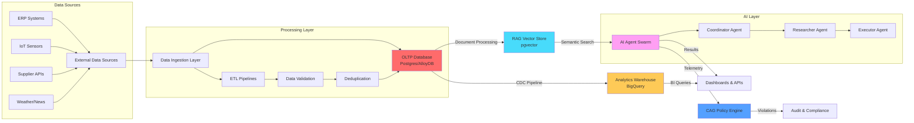

## Detailed Data Flow by Domain

### Supply Chain Transaction Flow

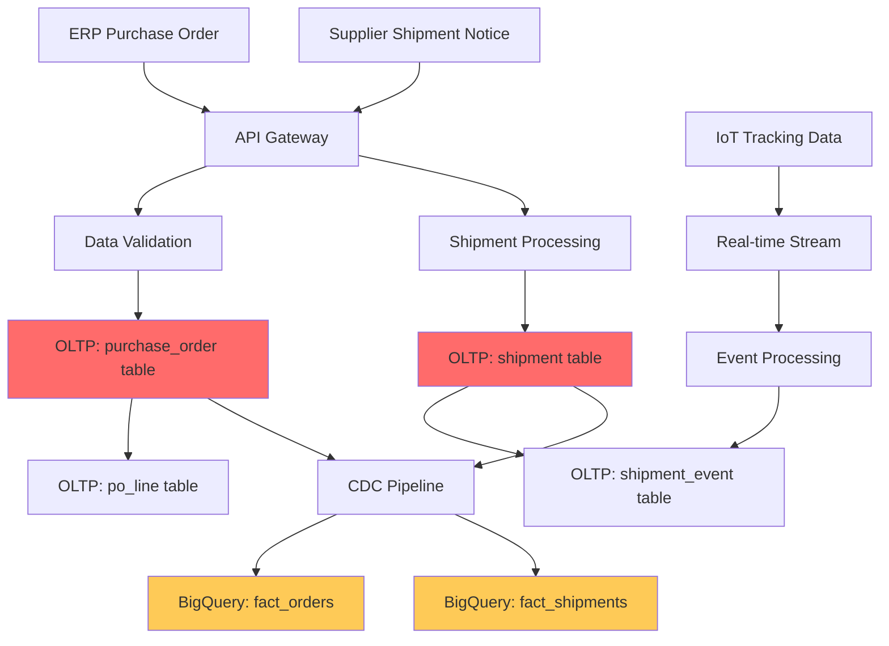

### RAG Knowledge Processing Flow

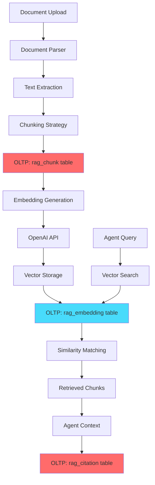

### AI Agent Execution Flow

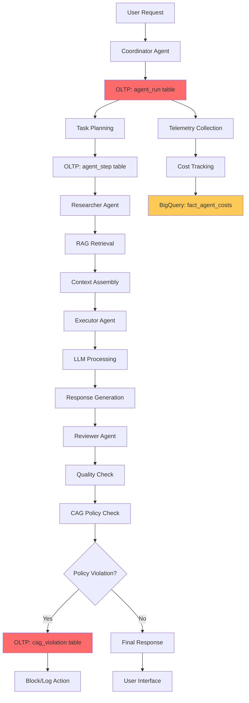

## Data Processing Patterns

### Change Data Capture (CDC) Pipeline

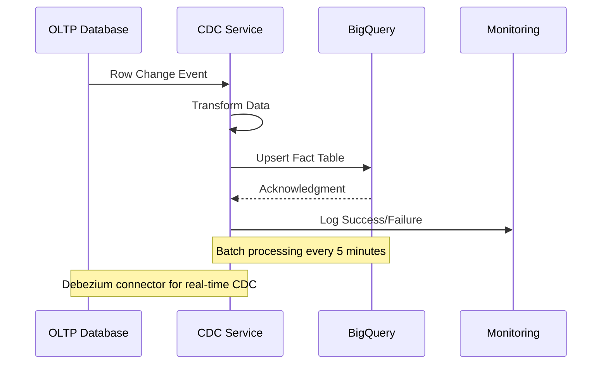

### Real-time Risk Event Processing

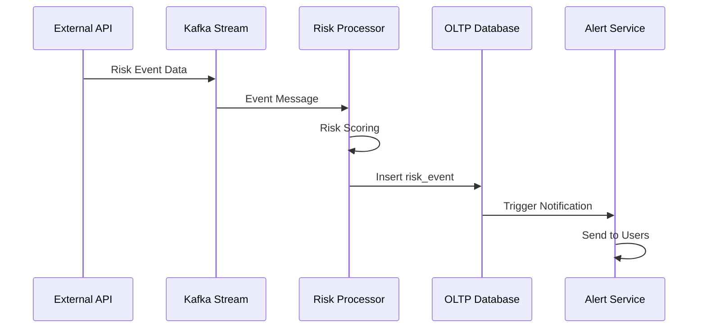

### Vector Embedding Pipeline

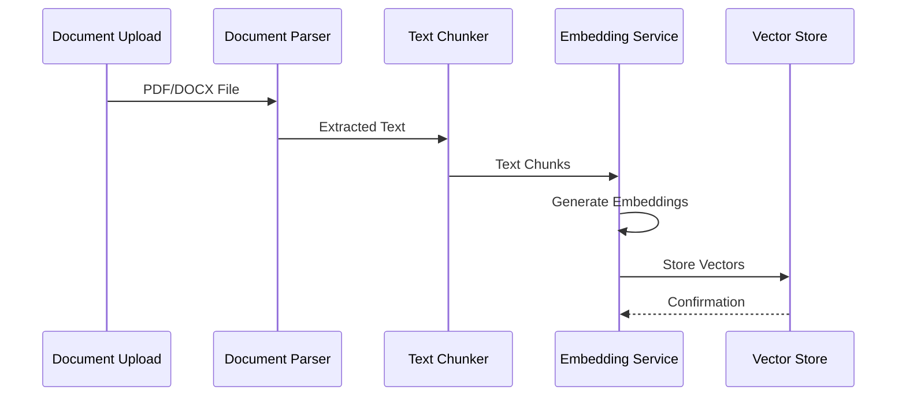

## Data Quality & Governance Flow

### Data Lineage Tracking

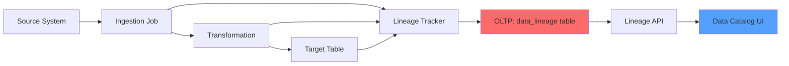

### PII Data Handling Flow

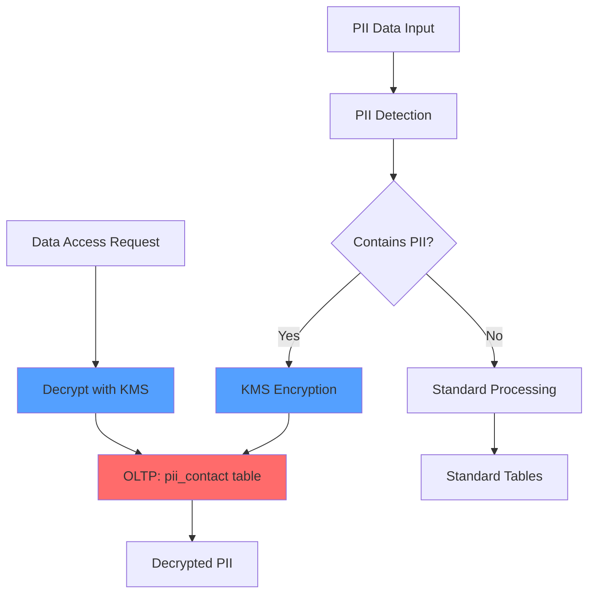

## Performance Optimization Patterns

### Read Replica Strategy

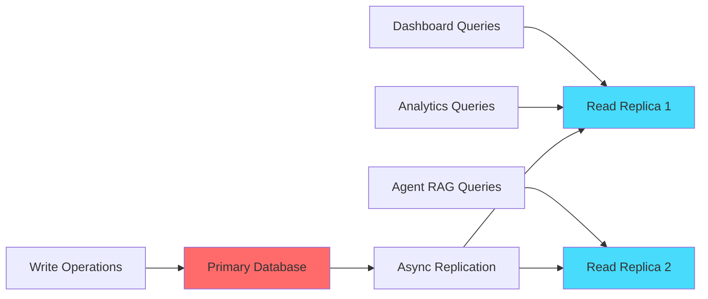

### Caching Strategy

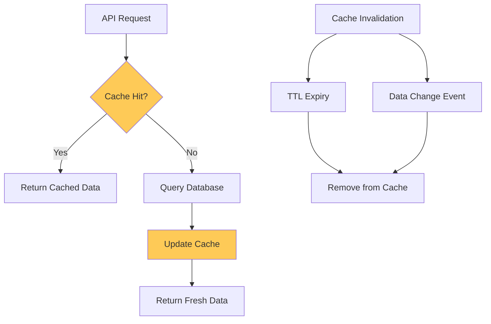

## Monitoring & Observability Flow

### Data Pipeline Monitoring

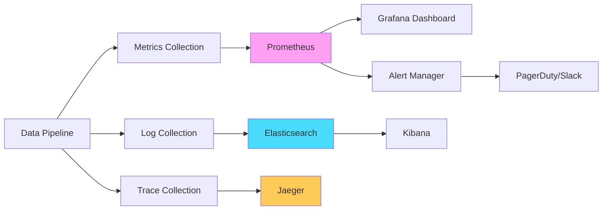

### Data Quality Monitoring

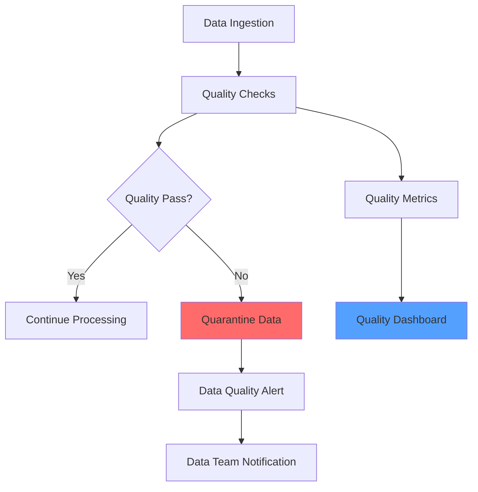

## Disaster Recovery Flow

### Backup & Recovery Strategy

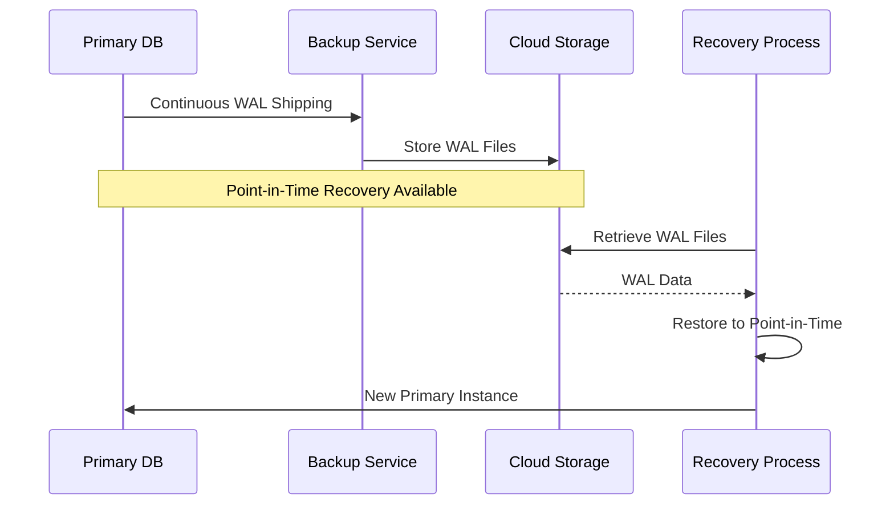

---

## Data Flow Metrics & SLAs

### Processing Latencies
- **OLTP Writes**: < 50ms p95
- **CDC Pipeline**: < 5 minutes end-to-end
- **Vector Search**: < 200ms p95
- **Agent Execution**: < 30 seconds p95

### Data Freshness SLAs
- **Real-time Events**: < 1 minute
- **Analytics Data**: < 15 minutes
- **RAG Embeddings**: < 1 hour
- **Risk Assessments**: < 5 minutes

### Throughput Targets
- **Transactions/sec**: 1,000 TPS sustained
- **Documents/hour**: 10,000 processed
- **Agent Runs/minute**: 100 concurrent
- **API Requests/sec**: 5,000 RPS

---

## Changelog

### v1.0.0 (2025-08-23)
- Initial data flow architecture documentation
- High-level and detailed flow diagrams
- Processing patterns for CDC, real-time events, and vector embeddings
- Data quality and governance flows
- Performance optimization patterns
- Monitoring and disaster recovery flows
- SLA definitions and metrics
