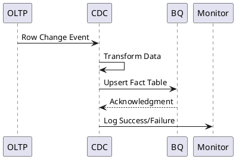
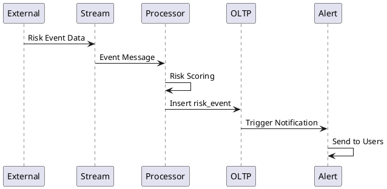
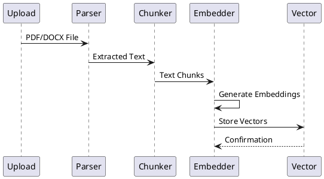
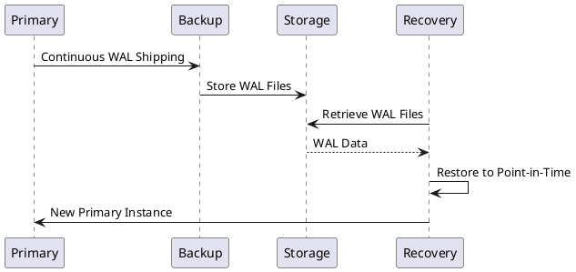

# SCIRM Data Flow Architecture

**Version:** v1.0.0  
**Date:** 2025-08-23  
**Owner:** Data Architecture Team  
**Status:** Active

This document details the data flow architecture for SCIRM, showing how data moves through the system from ingestion to AI processing to analytics output.

## High-Level Data Flow

```plantuml
@startuml
left to right direction
rectangle "External Data Sources" as A
B  -->  C[OLTP Database<br/>Postgres/AlloyDB]
C  --> |CDC Pipeline| D[Analytics Warehouse<br/>BigQuery]
C  --> |Document Processing| E[RAG Vector Store<br/>pgvector]
E  --> |Semantic Search| F[AI Agent Swarm]
F  --> |Telemetry| G[CAG Policy Engine]
F  --> |Results| H[Dashboards & APIs]
G  --> |Violations| I[Audit & Compliance]
D  --> |BI Queries| H
package "Data Sources" {
rectangle "ERP Systems" as A1
rectangle "IoT Sensors" as A2
rectangle "Supplier APIs" as A3
rectangle "Weather/News" as A4
A1  -->  A
A2  -->  A
A3  -->  A
A4  -->  A
}
package "Processing Layer" {
rectangle "ETL Pipelines" as B1
rectangle "Data Validation" as B2
rectangle "Deduplication" as B3
B  -->  B1
B1  -->  B2
B2  -->  B3
B3  -->  C
}
package "AI Layer" {
rectangle "Coordinator Agent" as F1
rectangle "Researcher Agent" as F2
rectangle "Executor Agent" as F3
F  -->  F1
F1  -->  F2
F2  -->  F3
}
note right of C : Color #ff6b6b
note right of E : Color #48dbfb
note right of D : Color #feca57
note right of F : Color #ff9ff3
note right of G : Color #54a0ff
@enduml
```

## Detailed Data Flow by Domain

### Supply Chain Transaction Flow

```plantuml
@startuml
rectangle "ERP Purchase Order" as A
B  -->  C[Data Validation]
C  -->  D[OLTP: purchase_order table]
D  -->  E[OLTP: po_line table]
rectangle "Supplier Shipment Notice" as F
B  -->  G[Shipment Processing]
G  -->  H[OLTP: shipment table]
H  -->  I[OLTP: shipment_event table]
rectangle "IoT Tracking Data" as J
K  -->  L[Event Processing]
L  -->  I
D  -->  M[CDC Pipeline]
H  -->  M
M  -->  N[BigQuery: fact_orders]
M  -->  O[BigQuery: fact_shipments]
note right of D : Color #ff6b6b
note right of H : Color #ff6b6b
note right of N : Color #feca57
note right of O : Color #feca57
@enduml
```

### RAG Knowledge Processing Flow

```plantuml
@startuml
rectangle "Document Upload" as A
B  -->  C[Text Extraction]
C  -->  D[Chunking Strategy]
D  -->  E[OLTP: rag_chunk table]
E  -->  F[Embedding Generation]
F  -->  G[OpenAI API]
G  -->  H[Vector Storage]
H  -->  I[OLTP: rag_embedding table]
rectangle "Agent Query" as J
K  -->  I
I  -->  L[Similarity Matching]
L  -->  M[Retrieved Chunks]
M  -->  N[Agent Context]
N  -->  O[OLTP: rag_citation table]
note right of E : Color #ff6b6b
note right of I : Color #48dbfb
note right of O : Color #ff6b6b
@enduml
```

### AI Agent Execution Flow

```plantuml
@startuml
rectangle "User Request" as A
B  -->  C[OLTP: agent_run table]
C  -->  D[Task Planning]
D  -->  E[OLTP: agent_step table]
E  -->  F[Researcher Agent]
F  -->  G[RAG Retrieval]
G  -->  H[Context Assembly]
H  -->  I[Executor Agent]
I  -->  J[LLM Processing]
J  -->  K[Response Generation]
K  -->  L[Reviewer Agent]
L  -->  M[Quality Check]
M  -->  N[CAG Policy Check]
N  -->  O{Policy Violation?}
O  --> |Yes| P[OLTP: cag_violation table]
O  --> |No| Q[Final Response]
P  -->  R[Block/Log Action]
Q  -->  S[User Interface]
C  -->  T[Telemetry Collection]
T  -->  U[Cost Tracking]
U  -->  V[BigQuery: fact_agent_costs]
note right of C : Color #ff6b6b
note right of P : Color #ff6b6b
note right of V : Color #feca57
@enduml
```

## Data Processing Patterns

### Change Data Capture (CDC) Pipeline



### Real-time Risk Event Processing



### Vector Embedding Pipeline



## Data Quality & Governance Flow

### Data Lineage Tracking

```plantuml
@startuml
left to right direction
rectangle "Source System" as A
B  -->  C[Transformation]
C  -->  D[Target Table]
B  -->  E[Lineage Tracker]
C  -->  E
D  -->  E
E  -->  F[OLTP: data_lineage table]
F  -->  G[Lineage API]
G  -->  H[Data Catalog UI]
note right of F : Color #ff6b6b
note right of H : Color #54a0ff
@enduml
```

### PII Data Handling Flow

```plantuml
@startuml
rectangle "PII Data Input" as A
B  -->  C{Contains PII?}
C  --> |Yes| D[KMS Encryption]
C  --> |No| E[Standard Processing]
D  -->  F[OLTP: pii_contact table]
E  -->  G[Standard Tables]
rectangle "Data Access Request" as H
I  -->  F
F  -->  J[Decrypted PII]
note right of F : Color #ff6b6b
note right of D : Color #54a0ff
note right of I : Color #54a0ff
@enduml
```

## Performance Optimization Patterns

### Read Replica Strategy

```plantuml
@startuml
left to right direction
rectangle "Write Operations" as A
B  -->  C[Async Replication]
C  -->  D[Read Replica 1]
C  -->  E[Read Replica 2]
rectangle "Analytics Queries" as F
rectangle "Agent RAG Queries" as G
rectangle "Dashboard Queries" as H
note right of B : Color #ff6b6b
note right of D : Color #48dbfb
note right of E : Color #48dbfb
@enduml
```

### Caching Strategy

```plantuml
@startuml
rectangle "API Request" as A
B  --> |Yes| C[Return Cached Data]
B  --> |No| D[Query Database]
D  -->  E[Update Cache]
E  -->  F[Return Fresh Data]
rectangle "Cache Invalidation" as G
G  -->  I[Data Change Event]
H  -->  J[Remove from Cache]
I  -->  J
note right of B : Color #feca57
note right of E : Color #feca57
@enduml
```

## Monitoring & Observability Flow

### Data Pipeline Monitoring

```plantuml
@startuml
left to right direction
rectangle "Data Pipeline" as A
B  -->  C[Prometheus]
C  -->  D[Grafana Dashboard]
A  -->  E[Log Collection]
E  -->  F[Elasticsearch]
F  -->  G[Kibana]
A  -->  H[Trace Collection]
H  -->  I[Jaeger]
C  -->  J[Alert Manager]
J  -->  K[PagerDuty/Slack]
note right of C : Color #ff9ff3
note right of F : Color #48dbfb
note right of I : Color #feca57
@enduml
```

### Data Quality Monitoring

```plantuml
@startuml
rectangle "Data Ingestion" as A
B  -->  C{Quality Pass?}
C  --> |Yes| D[Continue Processing]
C  --> |No| E[Quarantine Data]
E  -->  F[Data Quality Alert]
F  -->  G[Data Team Notification]
B  -->  H[Quality Metrics]
H  -->  I[Quality Dashboard]
note right of E : Color #ff6b6b
note right of I : Color #54a0ff
@enduml
```

## Disaster Recovery Flow

### Backup & Recovery Strategy



---

## Data Flow Metrics & SLAs

### Processing Latencies
- **OLTP Writes**: < 50ms p95
- **CDC Pipeline**: < 5 minutes end-to-end
- **Vector Search**: < 200ms p95
- **Agent Execution**: < 30 seconds p95

### Data Freshness SLAs
- **Real-time Events**: < 1 minute
- **Analytics Data**: < 15 minutes
- **RAG Embeddings**: < 1 hour
- **Risk Assessments**: < 5 minutes

### Throughput Targets
- **Transactions/sec**: 1,000 TPS sustained
- **Documents/hour**: 10,000 processed
- **Agent Runs/minute**: 100 concurrent
- **API Requests/sec**: 5,000 RPS

---

## Changelog

### v1.0.0 (2025-08-23)
- Initial data flow architecture documentation
- High-level and detailed flow diagrams
- Processing patterns for CDC, real-time events, and vector embeddings
- Data quality and governance flows
- Performance optimization patterns
- Monitoring and disaster recovery flows
- SLA definitions and metrics
