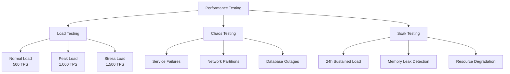
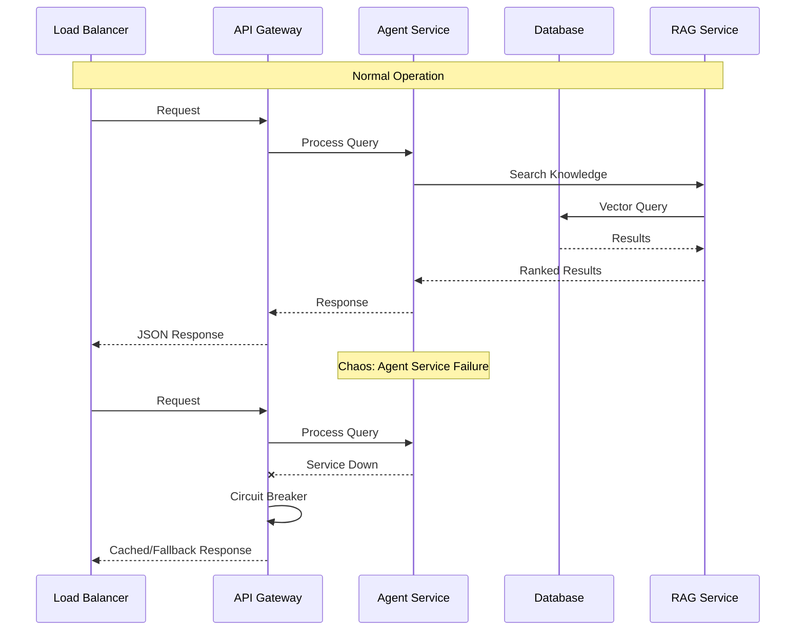
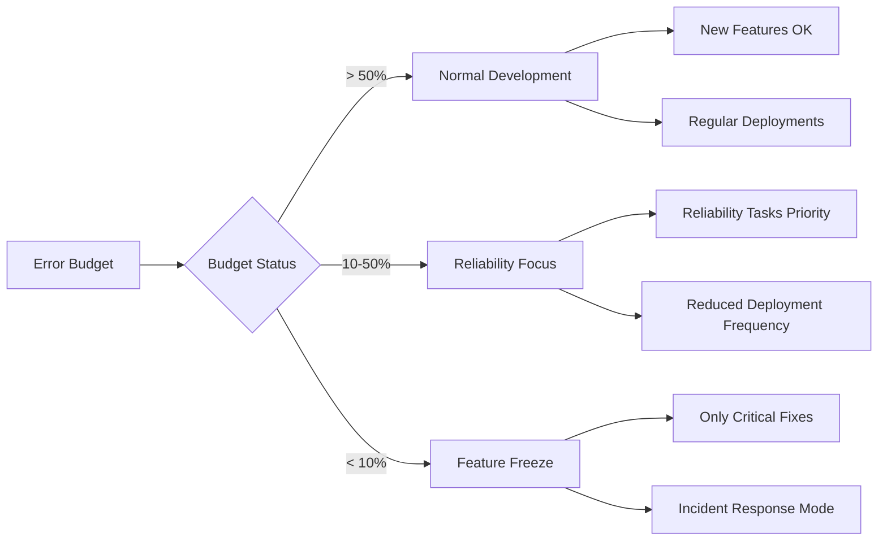
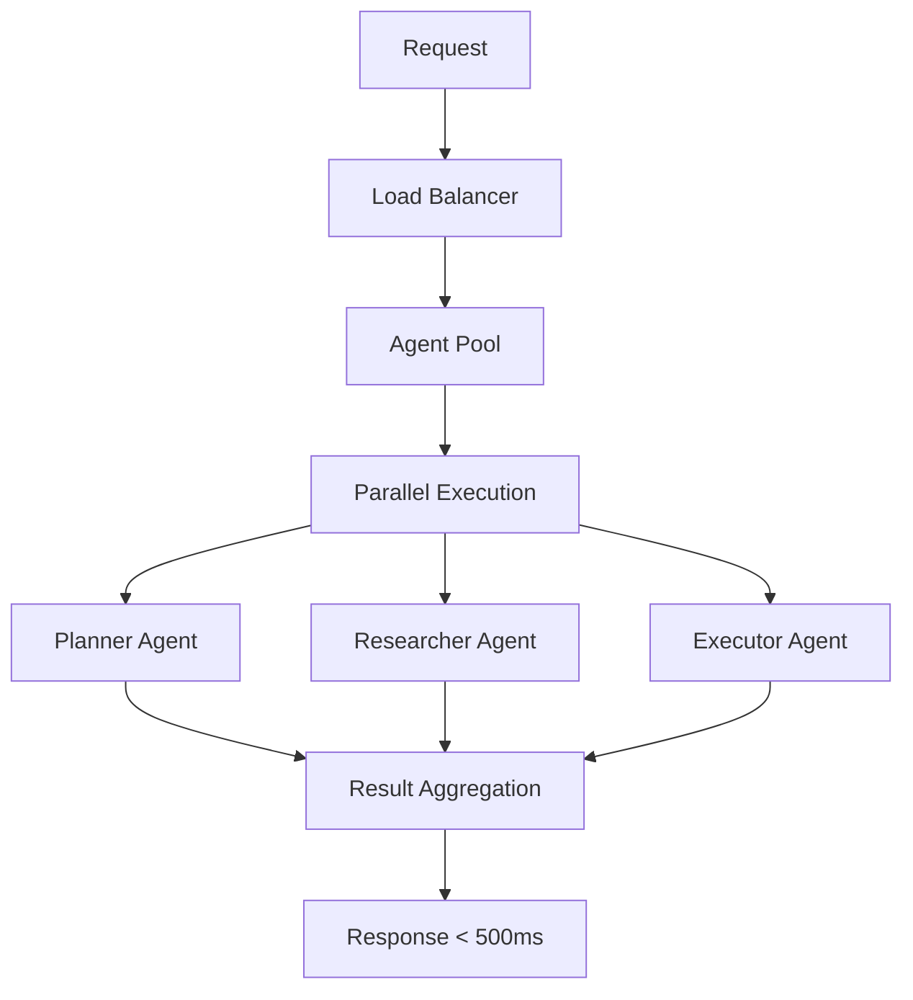
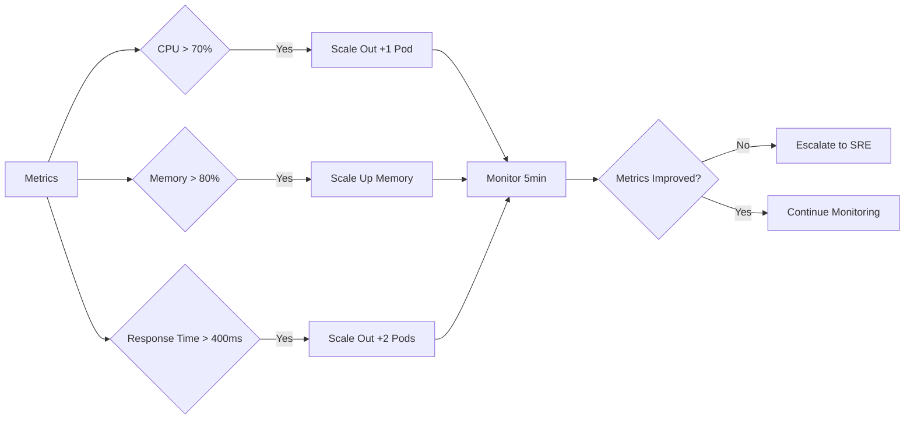

# Performance Architecture

## Overview

SCIRM's performance architecture ensures sub-500ms response times for supply chain risk assessment queries while maintaining 99.9% uptime under varying load conditions. This document outlines our non-functional requirements, testing strategies, error budgets, and performance monitoring approach.

## Non-Functional Requirements (NFRs)

| Requirement | Target | Measurement | Rationale |
|-------------|--------|-------------|-----------|
| Response Time | < 500ms (P95) | API gateway to response | Real-time risk assessment needs |
| Throughput | 1,000 TPS | Concurrent requests/second | Peak pharmaceutical supply chain load |
| Availability | 99.9% | Monthly uptime | Business continuity requirements |
| Agent Latency | < 200ms per step | Agent orchestrator timing | Multi-step workflow efficiency |
| RAG Search | < 100ms | Vector similarity search | Knowledge retrieval speed |
| Database OLTP | < 50ms | CRUD operations | Transactional data access |

## Performance Testing Strategy



### Load Testing Scenarios

| Test Type | Duration | Load Pattern | Success Criteria |
|-----------|----------|--------------|------------------|
| Baseline | 30 min | 100 TPS steady | < 200ms P95, 0% errors |
| Normal Load | 60 min | 500 TPS steady | < 300ms P95, < 0.1% errors |
| Peak Load | 30 min | 1,000 TPS steady | < 500ms P95, < 0.5% errors |
| Stress Test | 15 min | 1,500 TPS ramp | Graceful degradation |
| Spike Test | 10 min | 2,000 TPS burst | System recovery < 2 min |

### Chaos Engineering



## Error Budgets & SLOs

### Service Level Objectives

| Service | SLO | Error Budget (Monthly) | Burn Rate Alert |
|---------|-----|----------------------|-----------------|
| API Gateway | 99.9% | 43.2 minutes | > 10x normal |
| Agent Orchestrator | 99.5% | 3.6 hours | > 5x normal |
| RAG Search | 99.8% | 1.4 hours | > 8x normal |
| Database OLTP | 99.95% | 21.6 minutes | > 20x normal |
| Overall System | 99.9% | 43.2 minutes | > 10x normal |

### Error Budget Policy



## Performance Monitoring

### Key Performance Indicators

| Metric | Threshold | Alert Level | Action |
|--------|-----------|-------------|--------|
| Response Time P95 | > 400ms | Warning | Scale horizontally |
| Response Time P95 | > 600ms | Critical | Immediate investigation |
| Error Rate | > 0.1% | Warning | Check logs |
| Error Rate | > 1% | Critical | Incident response |
| CPU Utilization | > 70% | Warning | Resource planning |
| Memory Usage | > 80% | Critical | Scale/restart |

### Performance Dashboard

```
┌─────────────────────────────────────────────────────────────┐
│ SCIRM Performance Dashboard                                 │
├─────────────────────────────────────────────────────────────┤
│ Response Time (P95): 245ms ✓    Error Rate: 0.02% ✓       │
│ Throughput: 750 TPS ✓            Availability: 99.95% ✓    │
├─────────────────────────────────────────────────────────────┤
│ Service Health:                                             │
│ API Gateway    [████████████████████████████] 99.9%        │
│ Agent Swarm    [███████████████████████████ ] 99.5%        │
│ RAG Search     [████████████████████████████] 99.8%        │
│ Database       [████████████████████████████] 99.95%       │
├─────────────────────────────────────────────────────────────┤
│ Error Budget Remaining:                                     │
│ API Gateway: 85% │████████████████████████   │             │
│ Agent Swarm: 72% │██████████████████████     │             │
│ RAG Search:  91% │██████████████████████████ │             │
└─────────────────────────────────────────────────────────────┘
```

## Optimization Strategies

### Database Performance

| Optimization | Implementation | Expected Gain |
|--------------|----------------|---------------|
| Connection Pooling | PgBouncer with 100 connections | 30% latency reduction |
| Read Replicas | 2 read replicas for queries | 50% read throughput |
| Query Optimization | Indexes on org_id, created_at | 60% query speed |
| Caching Layer | Redis for frequent queries | 80% cache hit rate |

### Agent Orchestration



### Caching Strategy

| Cache Layer | TTL | Hit Rate Target | Use Case |
|-------------|-----|-----------------|----------|
| CDN | 24h | 95% | Static assets |
| Application | 5min | 80% | API responses |
| Database Query | 1min | 70% | Frequent queries |
| Vector Search | 10min | 60% | RAG results |

## Capacity Planning

### Resource Scaling Triggers



### Growth Projections

| Timeline | Expected Load | Infrastructure Needs |
|----------|---------------|---------------------|
| Q1 2025 | 500 TPS | Current capacity sufficient |
| Q2 2025 | 750 TPS | +2 API pods, +1 DB replica |
| Q3 2025 | 1,000 TPS | +4 API pods, +2 DB replicas |
| Q4 2025 | 1,250 TPS | Horizontal DB sharding |

## Incident Response

### Performance Degradation Playbook

```
1. DETECT → Alerts fire for response time > 600ms
2. ASSESS → Check dashboard for affected services
3. TRIAGE → Determine if user-facing impact
4. MITIGATE → Scale resources or enable fallbacks
5. RESOLVE → Identify and fix root cause
6. REVIEW → Post-incident analysis and improvements
```

### Escalation Matrix

| Severity | Response Time | Escalation Path |
|----------|---------------|-----------------|
| P0 - System Down | 5 minutes | On-call SRE → Engineering Manager |
| P1 - Degraded | 15 minutes | On-call Engineer → Team Lead |
| P2 - Warning | 1 hour | Automated ticket → Next business day |

## Performance Testing Tools

| Tool | Purpose | Configuration |
|------|---------|---------------|
| K6 | Load testing | 1,000 VUs, 30min duration |
| Chaos Monkey | Chaos engineering | Random service failures |
| Grafana | Monitoring | Real-time dashboards |
| Prometheus | Metrics collection | 15s scrape interval |

---

**Related Documentation:**
- [Database Architecture](database.md)
- [Observability Metrics](../observability/metrics.md)
- [Agent Sequences](agent-sequences.md)
- [ADR-003: Agent Communication Protocol](adr/ADR-003-agent-communication-protocol.md)
