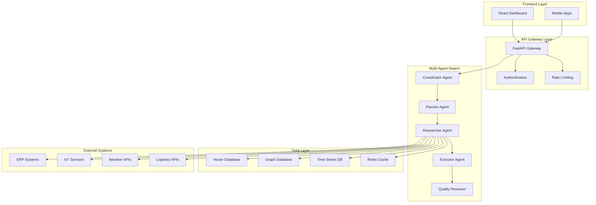

# SCIRM System Architecture Overview

## High-Level Architecture

SCIRM implements a cloud-native, microservices-based architecture designed for scalability, reliability, and real-time performance.



## Core Components

### 1. Multi-Agent AI Swarm
The heart of SCIRM's intelligence, consisting of specialized AI agents that work together to provide comprehensive supply chain risk management.

**Agent Responsibilities:**
- **Coordinator**: Orchestrates agent interactions and manages workflow
- **Planner**: Maintains context and plans task execution strategies
- **Researcher**: Retrieves and ranks relevant data from multiple sources
- **Executor**: Generates actionable recommendations with confidence scores
- **Quality Reviewer**: Validates outputs and ensures compliance standards

### 2. Data Integration Layer
Handles ingestion, processing, and storage of diverse data sources:

**Internal Data Sources:**
- ERP systems (SAP, Oracle, Microsoft Dynamics)
- Warehouse Management Systems (WMS)
- Transportation Management Systems (TMS)
- IoT sensors and monitoring devices

**External Data Sources:**
- Weather and climate information
- Logistics and shipping data
- Regulatory and compliance feeds
- Economic and market indicators

### 3. Knowledge Management
Advanced data storage and retrieval systems optimized for AI workloads:

- **Vector Database**: Semantic search and similarity matching
- **Graph Database**: Supply chain relationship mapping
- **Time Series Database**: Historical trend analysis
- **Caching Layer**: High-performance data access

## Technology Stack

### Backend Services
- **Language**: Python 3.11+
- **API Framework**: FastAPI
- **AI Framework**: LangChain + LangGraph
- **Message Queue**: Redis + Celery
- **Containerization**: Docker + Kubernetes

### Data Storage
- **Vector DB**: Pinecone or Weaviate
- **Graph DB**: Neo4j
- **Time Series**: InfluxDB
- **Primary DB**: PostgreSQL
- **Search**: Elasticsearch

### Frontend
- **Framework**: React 18 + Next.js 14
- **Styling**: Tailwind CSS + Material-UI
- **Visualization**: Chart.js + D3.js
- **State Management**: Redux Toolkit

### Infrastructure
- **Cloud**: Multi-cloud (AWS/Azure/GCP)
- **Orchestration**: Kubernetes
- **Service Mesh**: Istio
- **Monitoring**: Prometheus + Grafana
- **Logging**: ELK Stack

## Performance Characteristics

### Response Time Targets
- **Risk Assessment**: <500ms (95th percentile)
- **Dashboard Loading**: <2s initial load
- **Search Queries**: <1s response time
- **Recommendations**: <3s generation time

### Scalability Features
- **Horizontal Scaling**: Auto-scaling based on demand
- **Load Balancing**: Intelligent request distribution
- **Caching Strategy**: Multi-level caching for optimal performance
- **Database Sharding**: Distributed data storage

### Reliability Measures
- **High Availability**: 99.9% uptime SLA
- **Fault Tolerance**: Graceful degradation under load
- **Disaster Recovery**: Multi-region backup and failover
- **Circuit Breakers**: Prevent cascade failures

## Security Architecture

### Security Layers
1. **Network Security**: VPC isolation, firewalls, DDoS protection
2. **Application Security**: Input validation, SQL injection prevention
3. **Data Security**: Encryption at rest and in transit
4. **Access Control**: Multi-factor authentication, RBAC

### Compliance Framework
- **SOC2**: Security and availability controls
- **GDPR**: Data privacy and protection
- **HIPAA**: Healthcare data security
- **FDA 21 CFR Part 11**: Electronic records compliance

## Data Flow Architecture

### Real-time Processing Pipeline
```
Data Sources → Ingestion → Validation → Transformation → AI Processing → Storage → API Response
```

### Batch Processing Pipeline
```
Historical Data → ETL Pipeline → Feature Engineering → Model Training → Model Deployment
```

### Event-Driven Architecture
- **Event Sourcing**: Immutable event logs
- **Message Queues**: Asynchronous processing
- **Event Streaming**: Real-time data flow
- **CQRS**: Command Query Responsibility Segregation

## Deployment Architecture

### Environment Strategy
- **Development**: Feature branch deployments
- **Staging**: Integration testing environment
- **Production**: Blue-green deployments with canary releases

### Infrastructure as Code
- **Provisioning**: Terraform for infrastructure
- **Configuration**: Helm charts for Kubernetes
- **Secrets Management**: HashiCorp Vault
- **Monitoring**: Automated observability

## Integration Patterns

### API Design
- **REST APIs**: Standard HTTP-based interfaces
- **GraphQL**: Flexible data querying
- **WebSocket**: Real-time bidirectional communication
- **Webhooks**: Event-driven integrations

### Data Integration
- **ETL Pipelines**: Extract, Transform, Load processes
- **Real-time Streaming**: Apache Kafka for event streaming
- **API Connectors**: Pre-built integrations for common systems
- **Custom Adapters**: Flexible integration framework

## Monitoring & Observability

### Metrics Collection
- **Application Metrics**: Performance, errors, throughput
- **Infrastructure Metrics**: CPU, memory, network, storage
- **Business Metrics**: Risk scores, prediction accuracy
- **Custom Metrics**: Domain-specific measurements

### Alerting Strategy
- **Proactive Monitoring**: Predictive alerting
- **Threshold-based Alerts**: Performance boundaries
- **Anomaly Detection**: ML-powered anomaly identification
- **Escalation Policies**: Automated incident response

This architecture ensures SCIRM can scale to meet enterprise demands while maintaining the performance and reliability required for critical supply chain operations.
