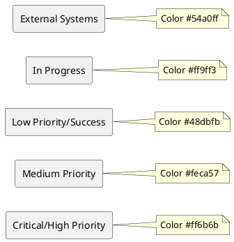
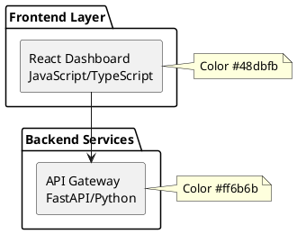

# SCIRM Documentation Style Guide

**Version:** v1.0.0  
**Date:** 2025-08-20  
**Owner:** Documentation Team  
**Status:** Active

This style guide ensures consistency, clarity, and maintainability across all SCIRM documentation, with special emphasis on Mermaid diagram standards and section requirements.

## Document Structure Standards

### Required Metadata
All documentation files must include:
```markdown
# Document Title

**Version:** v1.0.0  
**Date:** YYYY-MM-DD  
**Owner:** Team Name  
**Status:** Active/Draft/Deprecated
```

### Required Sections by Document Type

#### Product Requirements Document (PRD)
- Executive Summary
- Problem Statement
- Users & Personas
- Key Jobs-To-Be-Done
- Business Goals & Objectives
- Functional Requirements
- Non-Functional Requirements
- Risk Assessment & Mitigation
- Success Criteria & KPIs
- Value Stream Mapping (Mermaid)
- Key Performance Indicators Tree (Mermaid)
- Acceptance Criteria
- Dependencies & Assumptions
- Changelog

#### Product Design Document (PDD)
- Technical Architecture Overview
- High-Level Architecture (Mermaid)
- C4 Container Diagram (Mermaid)
- Multi-Agent Architecture
- Technology Stack
- Data Architecture
- Data Flow Architecture (Mermaid)
- Sequence Diagrams (Mermaid)
- Entity Relationship Diagram (Mermaid)
- Deployment Topology (Mermaid)
- API Design
- Performance Requirements
- Security Architecture
- Monitoring & Observability
- Testing Strategy
- Implementation Roadmap
- Changelog

#### Roadmap Document
- Executive Summary
- Current Status
- Release Train Schedule
- Development Timeline (Gantt Chart - Mermaid)
- Risk Assessment Heatmap (Mermaid)
- Detailed Risk Analysis
- Key Metrics & Goals
- Resource Allocation
- Success Criteria
- Dependencies & Assumptions
- Change Management
- Changelog

## PlantUML Diagram Standards

### General Guidelines
- Use PlantUML via ```plantuml fences for all diagrams
- Rendered at build time as SVG (no client-side JavaScript)
- Use consistent color schemes and styling
- Include descriptive titles for all diagrams
- Keep diagrams readable with appropriate spacing
- Use packages to group related components

### Color Palette


### Architecture Diagrams
- Use rectangles for services/components
- Use cylinders for databases
- Use diamonds for decision points
- Include technology stack in component labels
- Group related components in subgraphs

**Example:**


### Data Flow Diagrams
- Show clear directional flow with arrows
- Label data types or formats on connections
- Use different shapes for different data stores
- Include processing steps as intermediate nodes

### Sequence Diagrams
- Use descriptive participant names
- Include error handling paths with `alt` blocks
- Add notes for complex interactions
- Show return values clearly

### Gantt Charts
- Use consistent date formats (YYYY-MM-DD)
- Group tasks by phases or teams
- Mark completed tasks as `:done`
- Mark active tasks as `:active`
- Use descriptive task names

### Entity Relationship Diagrams
- Follow standard ER notation
- Include data types for all fields
- Show cardinality relationships clearly
- Use consistent naming conventions

## Writing Style Guidelines

### Tone and Voice
- **Professional but accessible**: Technical accuracy without jargon overload
- **Action-oriented**: Use active voice and clear imperatives
- **Concise**: Eliminate unnecessary words and redundancy
- **Consistent**: Use the same terms throughout documents

### Formatting Standards

#### Headers
- Use sentence case for headers
- Maximum 6 header levels
- Include descriptive, scannable headers
- Use consistent numbering where appropriate

#### Lists
- Use bullet points for unordered lists
- Use numbers for sequential processes
- Keep list items parallel in structure
- Bold key terms at the start of list items

#### Code and Technical Terms
- Use backticks for inline code: `function_name()`
- Use fenced code blocks with language specification
- Bold important technical concepts on first use
- Use consistent capitalization for product names

#### Links and References
- Use descriptive link text, not "click here"
- Reference other documents with relative paths
- Include section anchors for internal links
- Validate all external links regularly

### Technical Writing Best Practices

#### Requirements Writing
- Use "must", "should", "may" consistently per RFC 2119
- Include acceptance criteria for all requirements
- Specify measurable success metrics
- Provide context and rationale

#### Architecture Documentation
- Start with high-level overview, then drill down
- Include both logical and physical architecture views
- Document design decisions and trade-offs
- Provide deployment and operational guidance

## Quality Gates

### Documentation Completeness Checklist
- [ ] All required sections present
- [ ] Metadata complete and accurate
- [ ] Mermaid diagrams render correctly
- [ ] All internal links functional
- [ ] Spelling and grammar checked
- [ ] Technical accuracy reviewed
- [ ] Changelog updated

### Mermaid Diagram Validation
- [ ] Diagrams render without errors
- [ ] Consistent styling applied
- [ ] Appropriate diagram type for content
- [ ] Clear labels and descriptions
- [ ] Logical flow and relationships
- [ ] Color coding follows standards

### Review Process
1. **Author Review**: Self-review against style guide
2. **Peer Review**: Technical accuracy and clarity
3. **Editorial Review**: Style, grammar, and consistency
4. **Stakeholder Review**: Business alignment and completeness

## Maintenance Guidelines

### Version Control
- Use semantic versioning (MAJOR.MINOR.PATCH)
- Update version numbers for significant changes
- Maintain detailed changelogs
- Archive deprecated versions

### Regular Updates
- Review documentation quarterly
- Update diagrams when architecture changes
- Validate external links monthly
- Refresh screenshots and examples

### Accessibility Standards
- Use descriptive alt text for images
- Ensure sufficient color contrast
- Provide text alternatives for diagrams
- Use semantic HTML in rendered output

## Tools and Automation

### Recommended Tools
- **Editor**: VS Code with Markdown extensions
- **Diagram Validation**: Mermaid CLI
- **Link Checking**: markdown-link-check
- **Spell Check**: cspell
- **Build System**: MkDocs with Material theme

### CI/CD Integration
- Automated link validation
- Mermaid diagram compilation testing
- Spell check enforcement
- Style guide compliance checking
- Broken reference detection

## Examples and Templates

### Document Templates
- `docs/templates/prd-template.md` - Product Requirements Document template
- `docs/templates/pdd-template.md` - Product Design Document template  
- `docs/templates/adr-template.md` - Architecture Decision Record template
- `docs/templates/runbook-template.md` - Operational runbook template

### Mermaid Examples
- `docs/examples/architecture-examples.md` - System architecture diagrams
- `docs/examples/flow-examples.md` - Process flow charts
- `docs/examples/sequence-examples.md` - Interaction sequence diagrams
- `docs/examples/gantt-examples.md` - Project timeline charts

## Enforcement and Compliance

### Automated Checks
- MkDocs strict build must pass
- All Mermaid diagrams must compile
- Required sections must be present
- Links must be valid and accessible

### Manual Review Requirements
- Technical accuracy verification
- Business alignment confirmation
- Style guide compliance check
- Stakeholder approval process

---

## Changelog

### v1.0.0 (2025-08-20)
- Initial style guide creation
- Established Mermaid diagram standards
- Defined document structure requirements
- Created quality gates and review processes
- Added tool recommendations and automation guidelines

*This style guide is a living document and will be updated as documentation practices evolve.*
