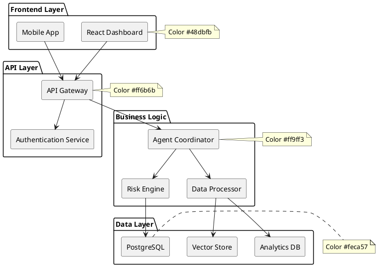

# Architecture Diagram Examples

This document provides examples of architecture diagrams using Mermaid for SCIRM documentation.

## High-Level System Architecture



## Microservices Architecture

```plantuml
@startuml
left to right direction
rectangle "Load Balancer" as A
B  -->  C[User Service]
B  -->  D[Supply Chain Service]
B  -->  E[Risk Service]
B  -->  F[AI Agent Service]
C  -->  G[User DB]
D  -->  H[Supply Chain DB]
E  -->  I[Risk DB]
F  -->  J[Vector DB]
note right of B : Color #ff6b6b
note right of F : Color #ff9ff3
@enduml
```
