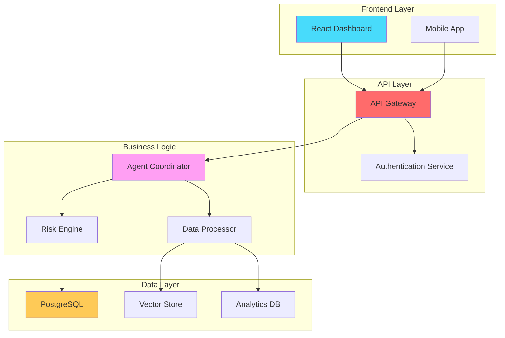
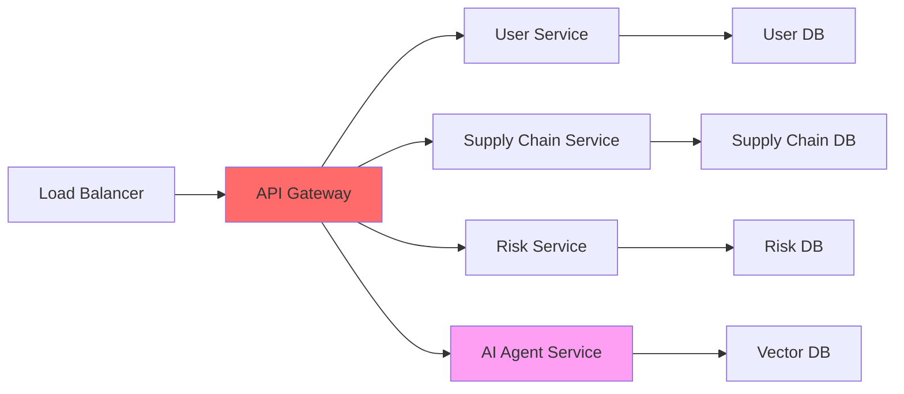

# Architecture Diagram Examples

This document provides examples of architecture diagrams using Mermaid for SCIRM documentation.

## High-Level System Architecture

```mermaid
graph TB
    subgraph "Frontend Layer"
        A[React Dashboard]
        B[Mobile App]
    end
    
    subgraph "API Layer"
        C[API Gateway]
        D[Authentication Service]
    end
    
    subgraph "Business Logic"
        E[Agent Coordinator]
        F[Risk Engine]
        G[Data Processor]
    end
    
    subgraph "Data Layer"
        H[PostgreSQL]
        I[Vector Store]
        J[Analytics DB]
    end
    
    A --> C
    B --> C
    C --> D
    C --> E
    E --> F
    E --> G
    F --> H
    G --> I
    G --> J
    
    style A fill:#48dbfb
    style C fill:#ff6b6b
    style E fill:#ff9ff3
    style H fill:#feca57
```

## Microservices Architecture

```mermaid
graph LR
    A[Load Balancer] --> B[API Gateway]
    B --> C[User Service]
    B --> D[Supply Chain Service]
    B --> E[Risk Service]
    B --> F[AI Agent Service]
    
    C --> G[User DB]
    D --> H[Supply Chain DB]
    E --> I[Risk DB]
    F --> J[Vector DB]
    
    style B fill:#ff6b6b
    style F fill:#ff9ff3
```
