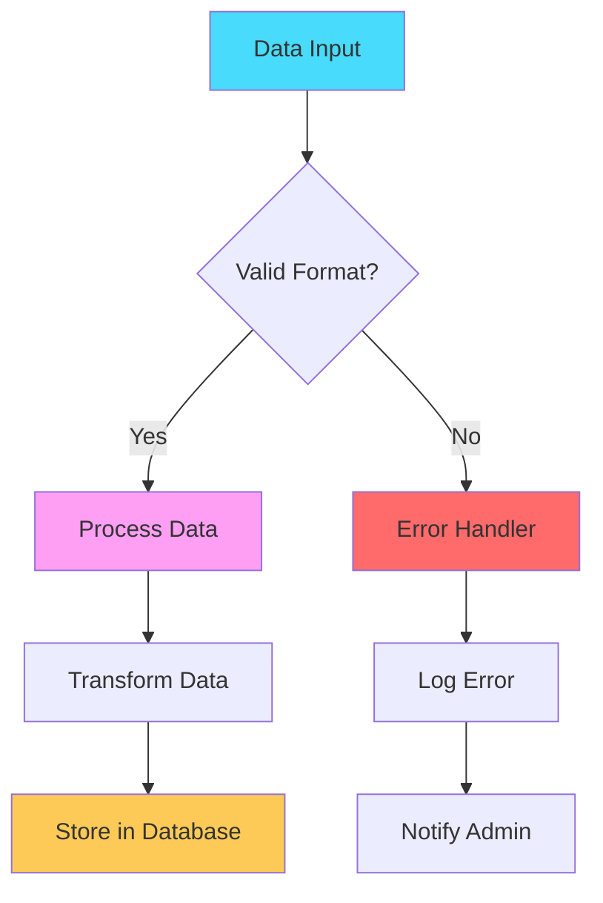
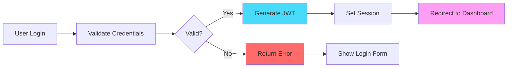
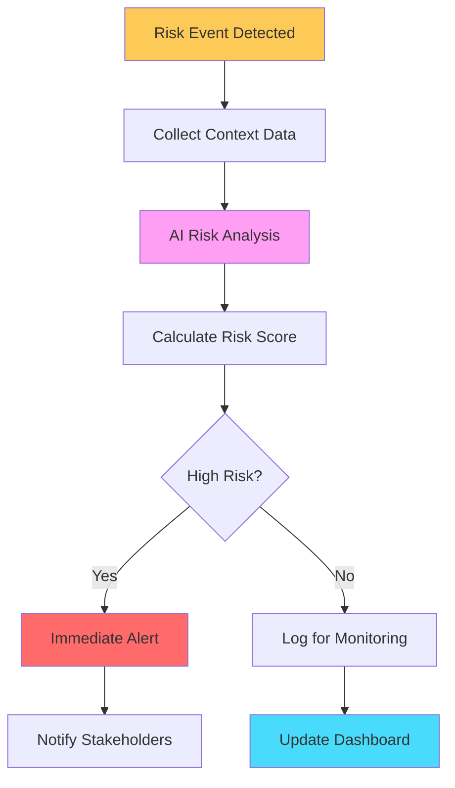

# Flow Diagram Examples

This document provides examples of flow diagrams using Mermaid for SCIRM documentation.

## Data Processing Flow

```mermaid
flowchart TD
    A[Data Input] --> B{Valid Format?}
    B -->|Yes| C[Process Data]
    B -->|No| D[Error Handler]
    C --> E[Transform Data]
    E --> F[Store in Database]
    D --> G[Log Error]
    G --> H[Notify Admin]
    
    style A fill:#48dbfb
    style C fill:#ff9ff3
    style F fill:#feca57
    style D fill:#ff6b6b
```

## User Authentication Flow

```mermaid
flowchart LR
    A[User Login] --> B[Validate Credentials]
    B --> C{Valid?}
    C -->|Yes| D[Generate JWT]
    C -->|No| E[Return Error]
    D --> F[Set Session]
    F --> G[Redirect to Dashboard]
    E --> H[Show Login Form]
    
    style D fill:#48dbfb
    style G fill:#ff9ff3
    style E fill:#ff6b6b
```

## Risk Assessment Flow

```mermaid
flowchart TB
    A[Risk Event Detected] --> B[Collect Context Data]
    B --> C[AI Risk Analysis]
    C --> D[Calculate Risk Score]
    D --> E{High Risk?}
    E -->|Yes| F[Immediate Alert]
    E -->|No| G[Log for Monitoring]
    F --> H[Notify Stakeholders]
    G --> I[Update Dashboard]
    
    style A fill:#feca57
    style C fill:#ff9ff3
    style F fill:#ff6b6b
    style I fill:#48dbfb
```
