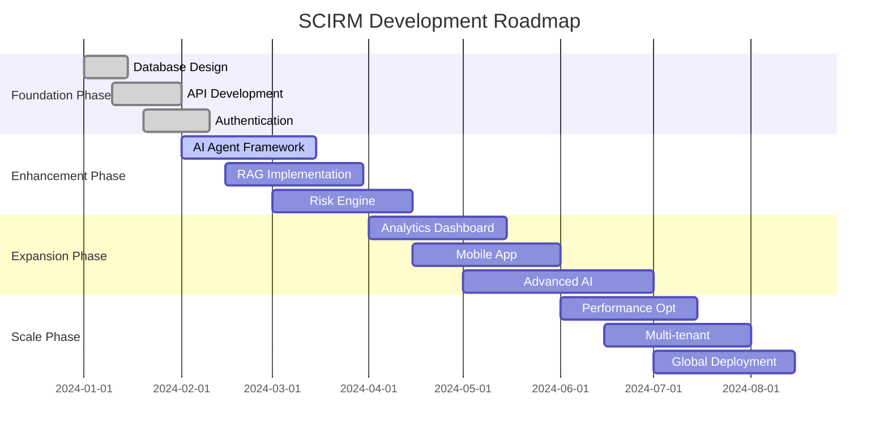
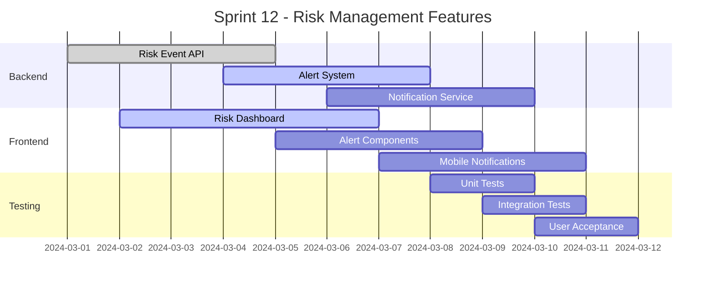
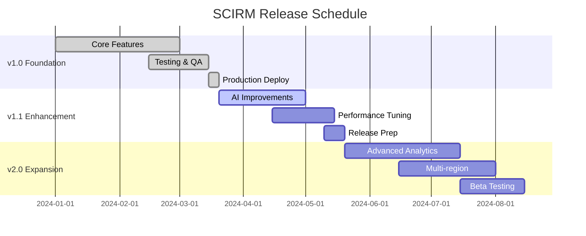

# Gantt Chart Examples

This document provides examples of Gantt charts using Mermaid for SCIRM documentation.

## Project Development Timeline

```mermaid
gantt
    title SCIRM Development Roadmap
    dateFormat  YYYY-MM-DD
    section Foundation Phase
    Database Design     :done,    db, 2024-01-01, 2024-01-15
    API Development     :done,    api, 2024-01-10, 2024-02-01
    Authentication      :done,    auth, 2024-01-20, 2024-02-10
    
    section Enhancement Phase
    AI Agent Framework  :active,  ai, 2024-02-01, 2024-03-15
    RAG Implementation  :         rag, 2024-02-15, 2024-03-30
    Risk Engine         :         risk, 2024-03-01, 2024-04-15
    
    section Expansion Phase
    Analytics Dashboard :         dash, 2024-04-01, 2024-05-15
    Mobile App          :         mobile, 2024-04-15, 2024-06-01
    Advanced AI         :         adv-ai, 2024-05-01, 2024-07-01
    
    section Scale Phase
    Performance Opt     :         perf, 2024-06-01, 2024-07-15
    Multi-tenant        :         tenant, 2024-06-15, 2024-08-01
    Global Deployment   :         deploy, 2024-07-01, 2024-08-15
```

## Sprint Planning Example

```mermaid
gantt
    title Sprint 12 - Risk Management Features
    dateFormat  YYYY-MM-DD
    section Backend
    Risk Event API      :done,    risk-api, 2024-03-01, 2024-03-05
    Alert System        :active,  alerts, 2024-03-04, 2024-03-08
    Notification Service:         notif, 2024-03-06, 2024-03-10
    
    section Frontend
    Risk Dashboard      :active,  dash, 2024-03-02, 2024-03-07
    Alert Components    :         alert-ui, 2024-03-05, 2024-03-09
    Mobile Notifications:         mobile-notif, 2024-03-07, 2024-03-11
    
    section Testing
    Unit Tests          :         unit, 2024-03-08, 2024-03-10
    Integration Tests   :         integration, 2024-03-09, 2024-03-11
    User Acceptance     :         uat, 2024-03-10, 2024-03-12
```

## Release Timeline

```mermaid
gantt
    title SCIRM Release Schedule
    dateFormat  YYYY-MM-DD
    section v1.0 Foundation
    Core Features       :done,    v1-core, 2024-01-01, 2024-03-01
    Testing & QA        :done,    v1-qa, 2024-02-15, 2024-03-15
    Production Deploy   :done,    v1-prod, 2024-03-15, 2024-03-20
    
    section v1.1 Enhancement
    AI Improvements     :active,  v11-ai, 2024-03-20, 2024-05-01
    Performance Tuning  :         v11-perf, 2024-04-15, 2024-05-15
    Release Prep        :         v11-prep, 2024-05-10, 2024-05-20
    
    section v2.0 Expansion
    Advanced Analytics  :         v2-analytics, 2024-05-20, 2024-07-15
    Multi-region        :         v2-region, 2024-06-15, 2024-08-01
    Beta Testing        :         v2-beta, 2024-07-15, 2024-08-15
```
