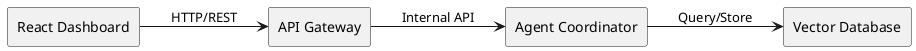
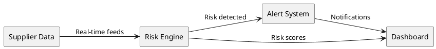
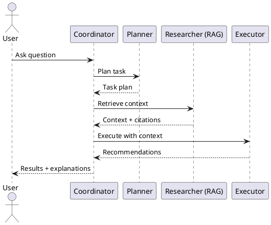
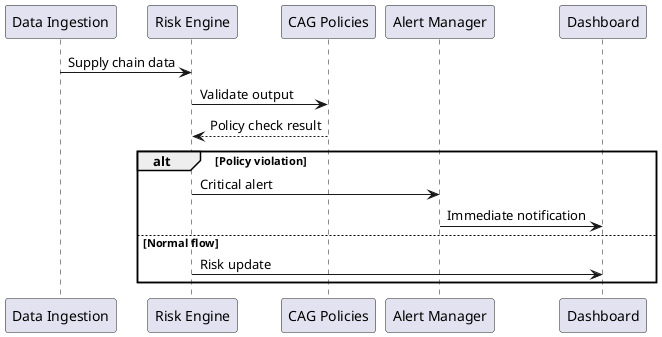
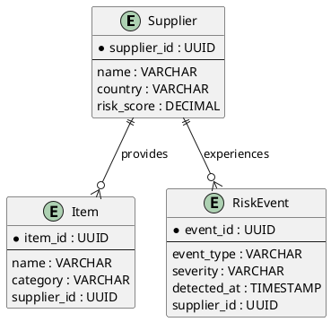
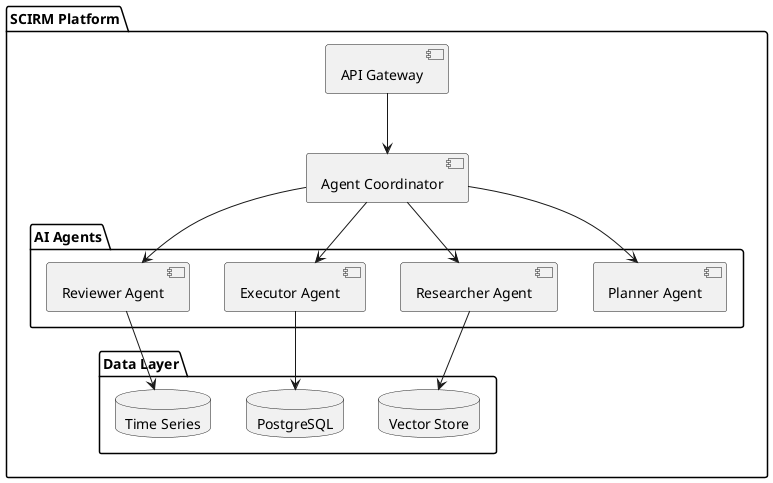
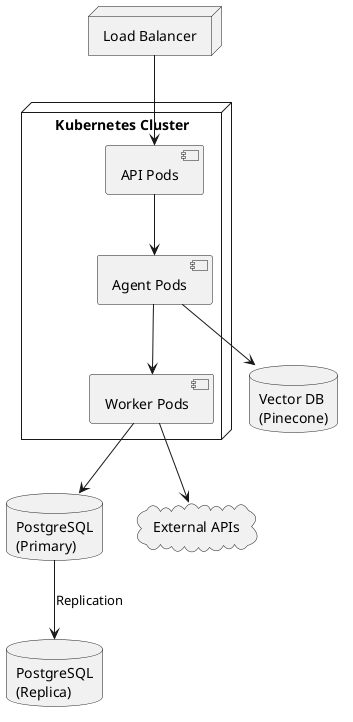
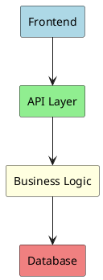
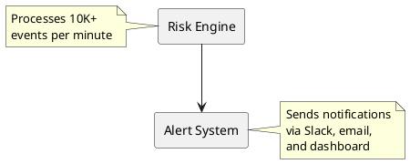

# PlantUML Examples for SCIRM Documentation

This page provides copy-pasteable PlantUML examples for common diagram types in SCIRM documentation.

## Flow Diagrams

### Basic Architecture Flow

### Supply Chain Flow

## Sequence Diagrams

### Agent Orchestration

### Risk Assessment Flow

## Entity Relationship Diagrams

### Core Data Model

## Component Diagrams

### Multi-Agent Architecture

## Deployment Diagrams

### Infrastructure Overview

## Styling Guidelines

### Color Schemes

Use consistent colors for component types:

### Notes and Documentation

Add explanatory notes to complex diagrams:

## Best Practices

1. **Direction**: Use `left to right direction` for wide architecture diagrams
2. **Grouping**: Use `package` or `node` to group related components
3. **Naming**: Use descriptive aliases (`as ALIAS`) for readability
4. **Documentation**: Add notes for complex interactions
5. **Consistency**: Use the same component names across diagrams

## Conversion from Mermaid

If converting from Mermaid:
- `graph LR` → `@startuml` + `left to right direction`
- `A-->B` → `A --> B`
- `subgraph "X"` → `package "X" { ... }`
- `style A fill:#color` → Add as note or use PlantUML skinparam
