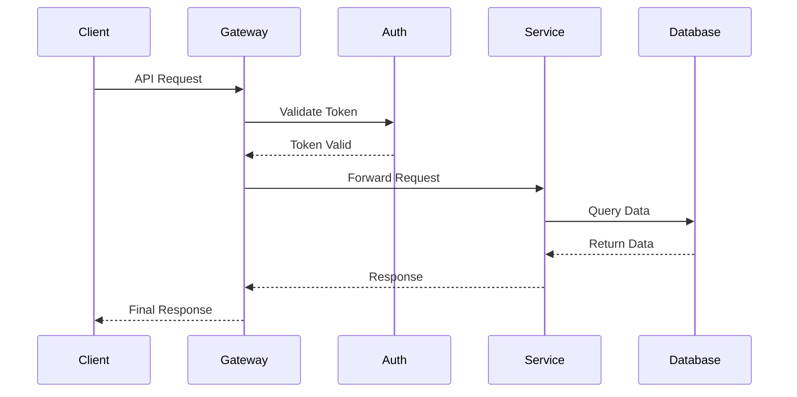
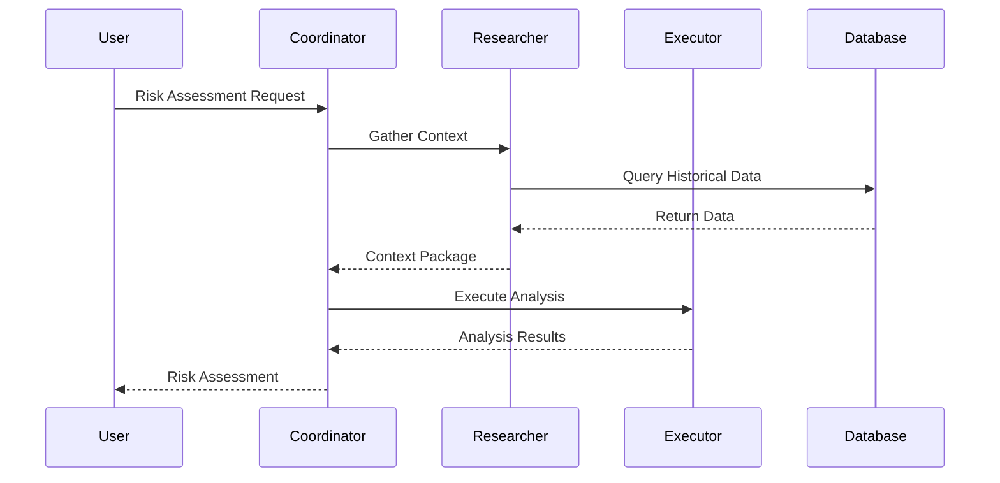
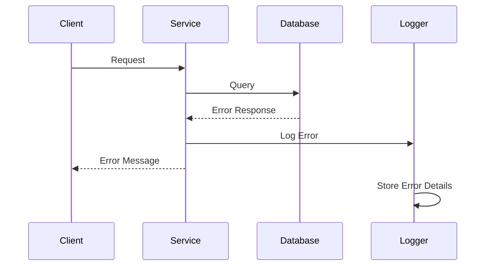

# Sequence Diagram Examples

This document provides examples of sequence diagrams using Mermaid for SCIRM documentation.

## API Request Sequence

## Agent Execution Sequence

## Error Handling Sequence

