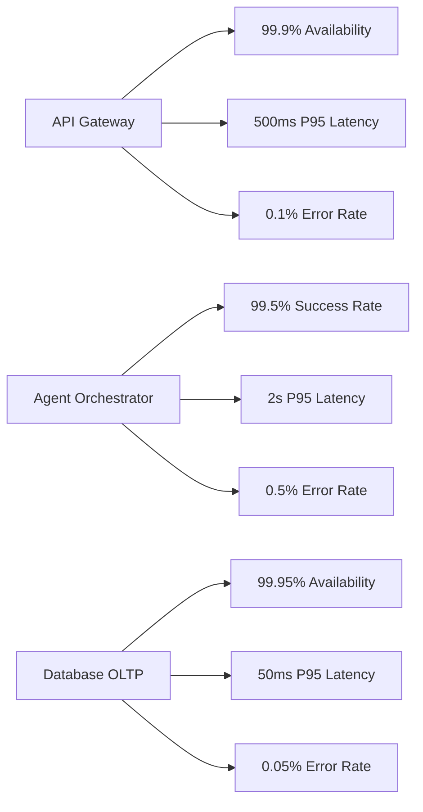
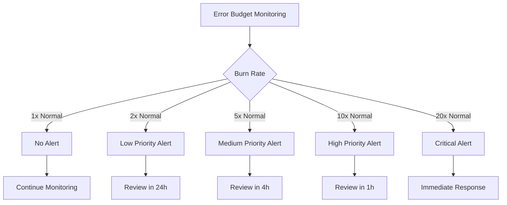
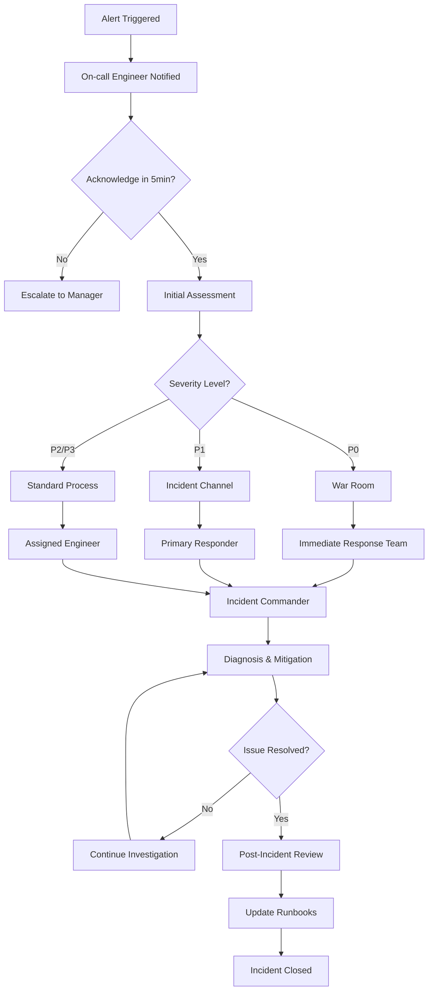

# Observability Metrics

## Overview

SCIRM's observability strategy provides comprehensive monitoring across all system components, enabling proactive incident detection, performance optimization, and business intelligence. This document defines our metrics taxonomy, SLIs/SLOs, alerting rules, and incident response procedures.

## Metrics Taxonomy

### System Metrics

| Metric Category | Purpose | Collection Method | Retention |
|----------------|---------|-------------------|-----------|
| Infrastructure | Resource utilization | Prometheus + Node Exporter | 90 days |
| Application | Service performance | Custom metrics + APM | 30 days |
| Business | KPI tracking | Database queries + events | 2 years |
| Security | Threat detection | Log analysis + CAG events | 1 year |

### Key Performance Indicators (KPIs)

| KPI | Definition | Target | Measurement Frequency |
|-----|------------|--------|----------------------|
| Mean Time to Detection (MTTD) | Time to identify incidents | < 5 minutes | Real-time |
| Mean Time to Recovery (MTTR) | Time to resolve incidents | < 30 minutes | Per incident |
| System Availability | Percentage uptime | 99.9% | Monthly |
| Agent Success Rate | Successful agent executions | > 95% | Hourly |
| User Satisfaction Score | Customer feedback rating | > 4.5/5 | Weekly |

## Service Level Indicators (SLIs)

### API Gateway SLIs

| SLI | Measurement | Good Events | Total Events |
|-----|-------------|-------------|--------------|
| Availability | HTTP 200-299 responses | Success responses | All responses |
| Latency | Response time P95 | Responses < 500ms | All responses |
| Error Rate | HTTP 5xx responses | Non-error responses | All responses |
| Throughput | Requests per second | N/A | Request count |

### Agent Swarm SLIs

| SLI | Measurement | Good Events | Total Events |
|-----|-------------|-------------|--------------|
| Agent Completion Rate | Successful agent runs | Completed runs | All initiated runs |
| Agent Latency | End-to-end execution time | Runs < 2s | All completed runs |
| Confidence Score | Output confidence level | Confidence > 0.7 | All outputs |
| Policy Compliance | CAG policy adherence | Compliant runs | All runs |

### Database SLIs

| SLI | Measurement | Good Events | Total Events |
|-----|-------------|-------------|--------------|
| Query Performance | Query execution time | Queries < 50ms | All queries |
| Connection Health | Active connections | Healthy connections | Total connections |
| Replication Lag | Replica sync delay | Lag < 1s | All sync events |
| Storage Utilization | Disk usage percentage | Usage < 80% | All measurements |

## Service Level Objectives (SLOs)

### Tier 1 Services (Critical)



### Tier 2 Services (Important)

| Service | Availability SLO | Latency SLO | Error Rate SLO |
|---------|------------------|-------------|----------------|
| RAG Search | 99.8% | P95 < 200ms | < 0.2% |
| CAG Engine | 99.9% | P95 < 100ms | < 0.1% |
| Analytics Pipeline | 99.5% | P95 < 5s | < 1% |

## Error Budget Management

### Error Budget Calculation

```
Error Budget = (1 - SLO) × Total Time Period

Example for 99.9% SLO over 30 days:
Error Budget = (1 - 0.999) × 30 days = 0.001 × 43,200 minutes = 43.2 minutes
```

### Error Budget Policy

| Budget Remaining | Action Required | Development Impact |
|------------------|-----------------|-------------------|
| > 50% | Normal operations | Full feature velocity |
| 10-50% | Reliability focus | Reduced feature velocity |
| < 10% | Feature freeze | Only reliability improvements |
| Exhausted | Incident response | Emergency fixes only |

### Burn Rate Alerts



## Alerting Rules

### Critical Alerts (P0)

| Alert | Condition | Threshold | Response Time |
|-------|-----------|-----------|---------------|
| Service Down | Availability < SLO | < 99% for 5min | 5 minutes |
| High Error Rate | Error rate > threshold | > 5% for 2min | 2 minutes |
| Database Outage | Connection failures | > 50% failures | 1 minute |
| Security Breach | CAG violations | Critical violation | Immediate |

### Warning Alerts (P1)

| Alert | Condition | Threshold | Response Time |
|-------|-----------|-----------|---------------|
| High Latency | Response time degraded | P95 > 2x SLO | 15 minutes |
| Resource Exhaustion | CPU/Memory high | > 80% for 10min | 30 minutes |
| Agent Failures | Success rate low | < 90% for 5min | 10 minutes |
| Error Budget Burn | Fast error consumption | > 5x normal rate | 1 hour |

### Prometheus Alerting Rules

```yaml
groups:
  - name: scirm_critical
    rules:
      - alert: APIGatewayDown
        expr: up{job="api-gateway"} == 0
        for: 1m
        labels:
          severity: critical
        annotations:
          summary: "API Gateway is down"
          description: "API Gateway has been down for more than 1 minute"
          
      - alert: HighErrorRate
        expr: rate(http_requests_total{status=~"5.."}[5m]) / rate(http_requests_total[5m]) > 0.05
        for: 2m
        labels:
          severity: critical
        annotations:
          summary: "High error rate detected"
          description: "Error rate is {{ $value | humanizePercentage }}"
          
      - alert: AgentLatencyHigh
        expr: histogram_quantile(0.95, rate(agent_duration_seconds_bucket[5m])) > 2
        for: 5m
        labels:
          severity: warning
        annotations:
          summary: "Agent latency is high"
          description: "95th percentile latency is {{ $value }}s"
```

## Dashboard Mockup

```
┌─────────────────────────────────────────────────────────────────────────────┐
│ SCIRM Observability Dashboard                          🟢 All Systems Healthy │
├─────────────────────────────────────────────────────────────────────────────┤
│ SLO Compliance (Last 30 Days)                                              │
│ ┌─────────────────┐ ┌─────────────────┐ ┌─────────────────┐              │
│ │ API Gateway     │ │ Agent Swarm     │ │ Database        │              │
│ │ 99.94% ✅       │ │ 99.67% ✅       │ │ 99.98% ✅       │              │
│ │ Target: 99.9%   │ │ Target: 99.5%   │ │ Target: 99.95%  │              │
│ └─────────────────┘ └─────────────────┘ └─────────────────┘              │
├─────────────────────────────────────────────────────────────────────────────┤
│ Error Budget Status                                                         │
│ API Gateway:    [████████████████████████████████████████] 87% remaining   │
│ Agent Swarm:    [████████████████████████████████████    ] 78% remaining   │
│ Database:       [██████████████████████████████████████  ] 92% remaining   │
├─────────────────────────────────────────────────────────────────────────────┤
│ Real-time Metrics                                                           │
│ ┌─────────────────┐ ┌─────────────────┐ ┌─────────────────┐              │
│ │ Requests/sec    │ │ Avg Latency     │ │ Active Users    │              │
│ │ 847 📈          │ │ 234ms 📉        │ │ 1,247 📈        │              │
│ └─────────────────┘ └─────────────────┘ └─────────────────┘              │
├─────────────────────────────────────────────────────────────────────────────┤
│ Recent Alerts                                                               │
│ 🟡 14:32 - Agent latency spike (resolved)                                  │
│ 🟢 14:15 - Database connection pool recovered                              │
│ 🟢 13:45 - API Gateway deployment successful                               │
└─────────────────────────────────────────────────────────────────────────────┘
```

## Incident Response Playbook

### Incident Severity Classification

| Severity | Impact | Response Time | Escalation |
|----------|--------|---------------|------------|
| P0 - Critical | System down, data loss | 5 minutes | Immediate |
| P1 - High | Degraded performance | 15 minutes | 30 minutes |
| P2 - Medium | Minor issues | 1 hour | 4 hours |
| P3 - Low | Cosmetic issues | Next business day | N/A |

### Incident Response Flow



### Runbook Templates

#### High Latency Incident

```
1. IMMEDIATE ACTIONS (0-5 minutes)
   - Check service health dashboard
   - Verify database connection pool
   - Review recent deployments
   - Check resource utilization

2. INVESTIGATION (5-15 minutes)
   - Analyze distributed traces
   - Check for database slow queries
   - Review agent execution patterns
   - Examine external API dependencies

3. MITIGATION OPTIONS
   - Scale horizontal replicas
   - Restart unhealthy pods
   - Enable circuit breakers
   - Rollback recent deployment

4. COMMUNICATION
   - Update incident channel every 15 minutes
   - Notify stakeholders if customer-facing
   - Document timeline and actions
```

#### Database Outage Incident

```
1. IMMEDIATE ACTIONS (0-2 minutes)
   - Activate read-only mode
   - Check database cluster status
   - Verify backup systems
   - Enable maintenance page if needed

2. ASSESSMENT (2-10 minutes)
   - Determine primary vs replica failure
   - Check for data corruption
   - Review recent schema changes
   - Assess failover requirements

3. RECOVERY ACTIONS
   - Initiate failover to replica
   - Restore from backup if needed
   - Verify data consistency
   - Gradually restore write access

4. VERIFICATION
   - Run health checks
   - Test critical user flows
   - Monitor for cascading failures
   - Confirm full service restoration
```

## Monitoring Tools & Integration

### Technology Stack

| Component | Tool | Purpose | Configuration |
|-----------|------|---------|---------------|
| Metrics Collection | Prometheus | Time-series metrics | 15s scrape interval |
| Visualization | Grafana | Dashboards & alerts | Real-time updates |
| Distributed Tracing | Jaeger | Request flow analysis | 1% sampling rate |
| Log Aggregation | ELK Stack | Centralized logging | 7-day retention |
| Alerting | PagerDuty | Incident management | Escalation policies |

### Custom Metrics

```python
# Example custom metrics in Python
from prometheus_client import Counter, Histogram, Gauge

# Business metrics
agent_runs_total = Counter('scirm_agent_runs_total', 
                          'Total agent runs', 
                          ['agent_type', 'status', 'org_id'])

agent_duration = Histogram('scirm_agent_duration_seconds',
                          'Agent execution time',
                          ['agent_type'])

confidence_score = Gauge('scirm_confidence_score',
                        'Agent output confidence',
                        ['agent_type', 'org_id'])

# Usage example
agent_runs_total.labels(
    agent_type='researcher',
    status='success',
    org_id='org-123'
).inc()

agent_duration.labels(agent_type='researcher').observe(1.23)
confidence_score.labels(agent_type='researcher', org_id='org-123').set(0.85)
```

## Performance Benchmarks

### Baseline Performance Targets

| Service Component | Metric | Target | Current Performance |
|-------------------|--------|--------|-------------------|
| API Gateway | P95 Latency | < 500ms | 234ms ✅ |
| Agent Orchestrator | P95 Latency | < 2s | 1.2s ✅ |
| RAG Vector Search | P95 Latency | < 200ms | 145ms ✅ |
| Database Queries | P95 Latency | < 50ms | 23ms ✅ |
| CAG Policy Check | P95 Latency | < 100ms | 45ms ✅ |

### Load Testing Results

```
Peak Load Test Results (1,000 TPS for 30 minutes):
┌─────────────────────────────────────────────────────────┐
│ Metric                    │ Target    │ Actual    │ ✓/✗ │
├─────────────────────────────────────────────────────────┤
│ Throughput               │ 1,000 TPS │ 1,247 TPS │ ✅  │
│ P95 Latency              │ < 500ms   │ 387ms     │ ✅  │
│ Error Rate               │ < 0.1%    │ 0.03%     │ ✅  │
│ CPU Utilization          │ < 70%     │ 62%       │ ✅  │
│ Memory Usage             │ < 80%     │ 71%       │ ✅  │
│ Database Connections     │ < 100     │ 78        │ ✅  │
└─────────────────────────────────────────────────────────┘
```

---

**Related Documentation:**
- [Performance Architecture](../architecture/performance.md)
- [Agent Sequences](../architecture/agent-sequences.md)
- [Database Architecture](../architecture/database.md)
- [CAG Policies](../security/cag-policies.md)
