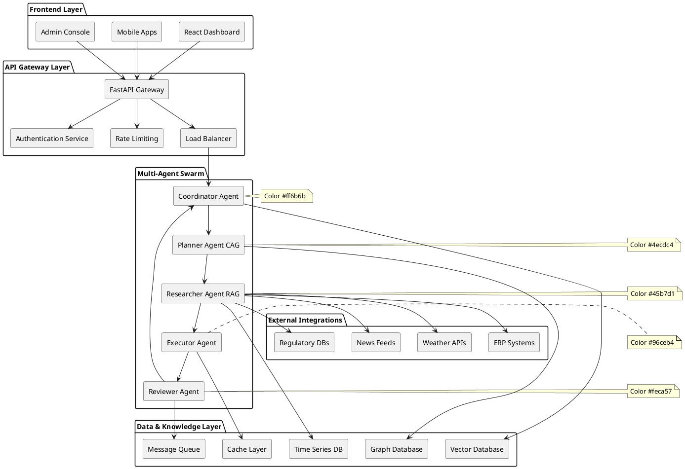
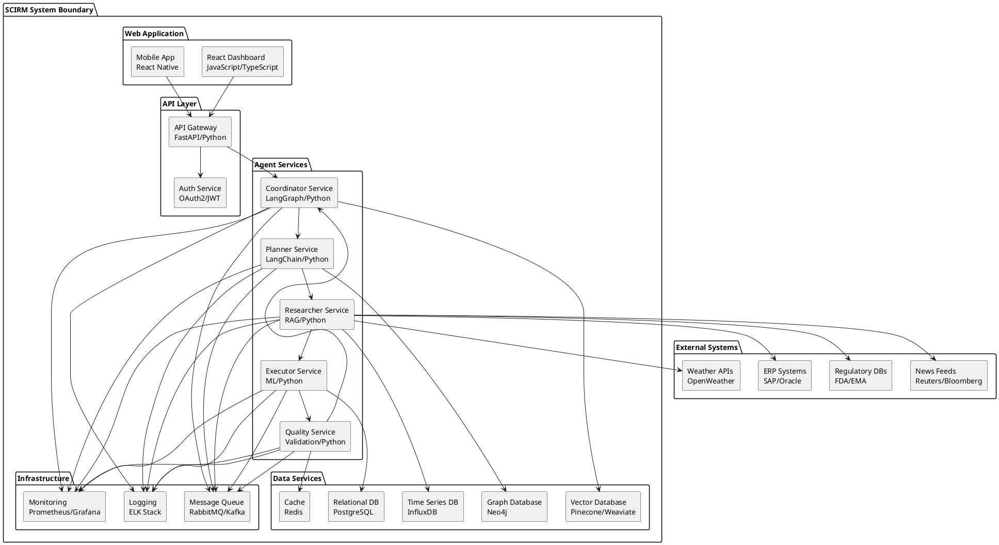
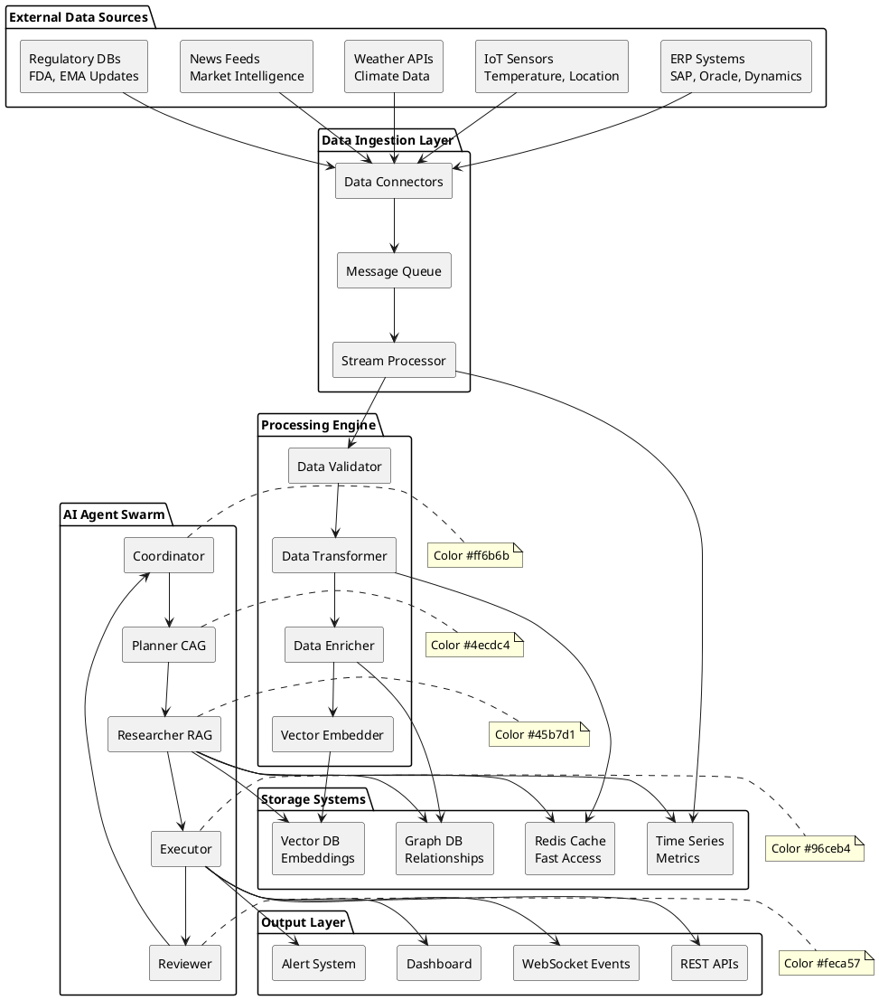
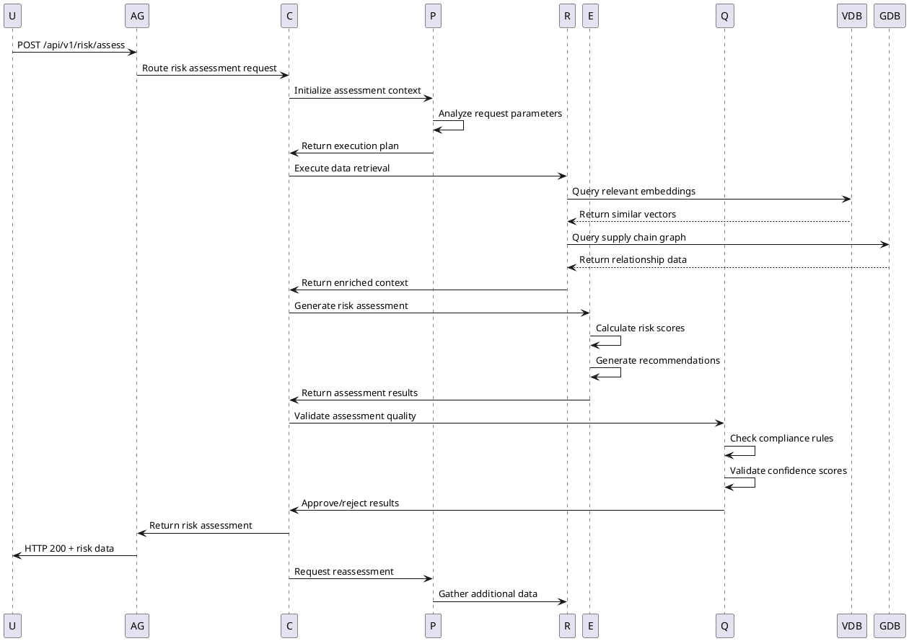
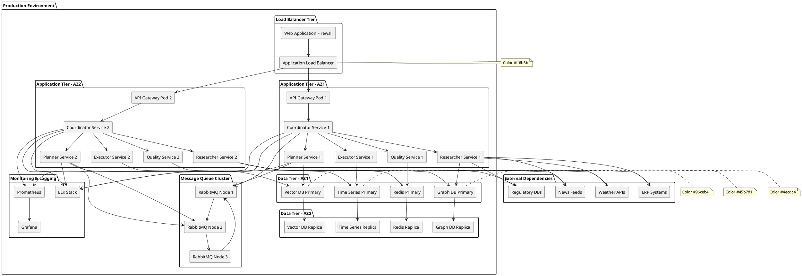

# SCIRM Product Design Document (PDD)

**Version:** v1.0.0  
**Date:** 2025-08-20  
**Owner:** Engineering Team  
**Status:** Approved

## Technical Architecture Overview

SCIRM implements a cloud-native, microservices-based architecture using a multi-agent AI swarm to deliver real-time supply chain risk management capabilities.

### High-Level Architecture



## C4 Container Diagram



## Multi-Agent Architecture

### Agent Specifications

#### 1. Coordinator Agent (Meta-Agent)
- **Purpose**: Orchestrates the entire agent swarm
- **Technology**: LangGraph state machine
- **Responsibilities**:
  - Request routing and load balancing
  - Agent health monitoring
  - Retry logic and error handling
  - State management across agents

#### 2. Planner Agent (CAG - Context Augmented Generation)
- **Purpose**: Maintains context and plans task execution
- **Technology**: LangChain + Custom context management
- **Responsibilities**:
  - Organization-specific context maintenance
  - Task decomposition and planning
  - Context window optimization
  - Memory management

#### 3. Researcher Agent (RAG - Retrieval Augmented Generation)
- **Purpose**: Fetches and ranks relevant data
- **Technology**: Vector embeddings + Semantic search
- **Responsibilities**:
  - Multi-source data retrieval
  - Relevance scoring and ranking
  - Data freshness validation
  - Source credibility assessment

#### 4. Executor Agent
- **Purpose**: Generates actionable recommendations
- **Technology**: LLM + Domain-specific models
- **Responsibilities**:
  - Risk assessment calculations
  - Mitigation strategy generation
  - Confidence scoring
  - Action prioritization

#### 5. Quality Reviewer Agent
- **Purpose**: Validates outputs and ensures compliance
- **Technology**: Rule-based validation + ML models
- **Responsibilities**:
  - Output quality assessment
  - Compliance rule enforcement
  - Confidence validation
  - Audit trail generation

## Technology Stack

### Backend Services
- **Language**: Python 3.11+
- **Framework**: FastAPI for APIs
- **Agent Framework**: LangChain + LangGraph
- **AI Models**: OpenAI GPT-4, Claude-3, Hugging Face models
- **Message Queue**: Redis + Celery
- **Caching**: Redis Cluster

### Data Storage
- **Vector Database**: Pinecone or Weaviate
- **Graph Database**: Neo4j for supply chain relationships
- **Time Series**: InfluxDB for metrics and monitoring
- **Primary Database**: PostgreSQL
- **Document Store**: Elasticsearch

### Frontend
- **Framework**: React 18 + Next.js 14
- **UI Library**: Tailwind CSS + Material-UI
- **Charts**: Chart.js + D3.js for visualizations
- **State Management**: Redux Toolkit
- **Real-time**: WebSocket connections

### Infrastructure
- **Container Platform**: Docker + Kubernetes
- **Cloud Provider**: AWS/Azure/GCP (multi-cloud)
- **Service Mesh**: Istio for microservices communication
- **Monitoring**: Prometheus + Grafana
- **Logging**: ELK Stack (Elasticsearch, Logstash, Kibana)

## Data Architecture

### Data Sources
1. **Internal Systems**
   - ERP systems (SAP, Oracle, Microsoft Dynamics)
   - WMS/TMS (Warehouse/Transportation Management)
   - IoT sensors and devices
   - Financial systems

2. **External Data Feeds**
   - Weather and climate data
   - Logistics and transportation data
   - Regulatory and compliance feeds
   - Market and economic indicators

### Data Processing Pipeline

```plantuml
@startuml
left to right direction
package "Data Ingestion" {
rectangle "Raw Data Sources" as A
rectangle "API Connectors" as B
rectangle "Webhook Listeners" as C
rectangle "Batch Processors" as D
}
package "Data Validation" {
rectangle "Schema Validation" as E
rectangle "Data Quality Checks" as F
rectangle "Completeness Validation" as G
rectangle "Format Standardization" as H
}
package "Data Transformation" {
rectangle "Data Normalization" as I
rectangle "Entity Resolution" as J
rectangle "Data Enrichment" as K
rectangle "Semantic Chunking" as L
}
package "Vector Processing" {
rectangle "Embedding Generation" as M
rectangle "Vector Indexing" as N
rectangle "Metadata Tagging" as O
rectangle "Version Control" as P
}
package "Storage Layer" {
rectangle "Vector Database" as Q
rectangle "Graph Database" as R
rectangle "Time Series DB" as S
rectangle "Document Store" as T
}
A  -->  B
A  -->  C
A  -->  D
B  -->  E
C  -->  E
D  -->  E
E  -->  F
F  -->  G
G  -->  H
H  -->  I
I  -->  J
J  -->  K
K  -->  L
L  -->  M
M  -->  N
N  -->  O
O  -->  P
P  -->  Q
P  -->  R
P  -->  S
P  -->  T
note right of A : Color #ff9999
note right of Q : Color #99ff99
note right of R : Color #99ff99
note right of S : Color #99ff99
note right of T : Color #99ff99
@enduml
```



## Data Flow Architecture



## Sequence Diagram: Risk Assessment Flow



### Vector Embeddings Strategy
- **Model**: OpenAI text-embedding-ada-002 or custom domain models
- **Dimensions**: 1536 for general, 768 for domain-specific
- **Chunking**: Semantic chunking with 500-token overlap
- **Metadata**: Source, timestamp, confidence, lineage
- **Versioning**: Immutable embeddings with version tracking

## API Design

### RESTful API Endpoints
```
POST /api/v1/risk/assess          # Real-time risk assessment
GET  /api/v1/risk/history         # Historical risk data
POST /api/v1/recommendations      # Get recommendations
GET  /api/v1/supply-chain/map     # Supply chain visualization
POST /api/v1/scenarios/simulate   # Scenario modeling
GET  /api/v1/alerts               # Active alerts
```

### WebSocket Events
```
risk_update          # Real-time risk score changes
alert_triggered      # New alert notifications
recommendation_ready # New recommendations available
system_status        # System health updates
```

### Authentication & Authorization
- **Protocol**: OAuth 2.0 + JWT tokens
- **MFA**: TOTP-based multi-factor authentication
- **RBAC**: Role-based access control
- **API Keys**: For system-to-system integration

## Performance Requirements

### Response Time Targets
- **Risk Assessment**: <500ms (95th percentile)
- **Dashboard Load**: <2s initial load
- **Search Queries**: <1s response time
- **Recommendations**: <3s generation time

### Scalability Targets
- **Concurrent Users**: 10,000+
- **API Throughput**: 100,000 requests/minute
- **Data Ingestion**: 1M events/minute
- **Storage**: Petabyte-scale data handling

### Availability Requirements
- **Uptime SLA**: 99.9% (8.76 hours downtime/year)
- **Recovery Time**: <15 minutes for critical failures
- **Backup Strategy**: Real-time replication + daily backups
- **Disaster Recovery**: Multi-region failover

## Security Architecture

### Security Controls
1. **Network Security**
   - VPC with private subnets
   - WAF for application protection
   - DDoS protection
   - Network segmentation

2. **Application Security**
   - Input validation and sanitization
   - SQL injection prevention
   - XSS protection
   - CSRF tokens

3. **Data Security**
   - Encryption at rest (AES-256)
   - Encryption in transit (TLS 1.3)
   - Key management (HSM/KMS)
   - Data masking for PII

4. **Access Control**
   - Zero-trust architecture
   - Principle of least privilege
   - Regular access reviews
   - Audit logging

## Monitoring & Observability

### Metrics Collection
- **Application Metrics**: Response times, error rates, throughput
- **Infrastructure Metrics**: CPU, memory, disk, network
- **Business Metrics**: Risk scores, prediction accuracy, user engagement
- **Custom Metrics**: Agent performance, model accuracy, data quality

### Alerting Strategy
- **Critical**: P0 alerts for system outages
- **High**: P1 alerts for performance degradation
- **Medium**: P2 alerts for capacity warnings
- **Low**: P3 alerts for maintenance needs

### Logging Standards
- **Format**: Structured JSON logging
- **Levels**: DEBUG, INFO, WARN, ERROR, FATAL
- **Correlation**: Request tracing across services
- **Retention**: 90 days for application logs, 1 year for audit logs

## Deployment Architecture

### Environment Strategy
- **Development**: Feature branches, local development
- **Staging**: Integration testing, performance testing
- **Production**: Blue-green deployment with canary releases

### CI/CD Pipeline
```
Code Commit → Unit Tests → Integration Tests → Security Scans → 
Build → Deploy to Staging → E2E Tests → Deploy to Production
```

### Infrastructure as Code
- **Tool**: Terraform for infrastructure provisioning
- **Configuration**: Helm charts for Kubernetes deployments
- **Secrets**: HashiCorp Vault for secret management
- **Monitoring**: Automated infrastructure monitoring

## Data Governance

### Data Quality Framework
- **Completeness**: 95%+ data completeness
- **Accuracy**: 99%+ data accuracy validation
- **Timeliness**: Real-time data freshness monitoring
- **Consistency**: Cross-system data validation

### Compliance Requirements
- **SOC2**: Security and availability controls
- **GDPR**: Data privacy and protection
- **HIPAA**: Healthcare data security (for pharma clients)
- **FDA 21 CFR Part 11**: Electronic records compliance

## Testing Strategy

### Test Pyramid
1. **Unit Tests**: 80% code coverage minimum
2. **Integration Tests**: API and service integration
3. **End-to-End Tests**: Critical user journeys
4. **Performance Tests**: Load and stress testing
5. **Security Tests**: SAST, DAST, penetration testing

### AI Model Testing
- **Model Validation**: Cross-validation, holdout testing
- **Bias Testing**: Fairness and bias detection
- **Drift Monitoring**: Model performance degradation
- **A/B Testing**: Model comparison and optimization

## Entity Relationship Diagram


> **TODO**: This diagram requires manual conversion from Mermaid to PlantUML.
> See the PlantUML documentation for proper syntax.

```plantuml
@startuml
!theme plain
title Erdiagram (Conversion Required)

> **NOTE**: Complex diagram conversion required.
> Original Mermaid syntax needs manual PlantUML conversion.

rectangle "TODO: Convert to PlantUML" as TODO
@enduml
```

## Deployment Topology



## Implementation Roadmap

### Phase 1: Foundation (Months 1-3)
- **Infrastructure Setup**: Kubernetes cluster, CI/CD pipelines
- **Core Services**: API Gateway, Authentication, basic monitoring
- **Data Layer**: PostgreSQL, Redis, initial vector database setup
- **Agent Framework**: Basic Coordinator and Planner agents

### Phase 2: AI Agent Swarm (Months 4-6)
- **Researcher Agent**: RAG implementation with vector search
- **Executor Agent**: Risk assessment algorithms and ML models
- **Quality Reviewer**: Validation rules and compliance checks
- **Integration**: ERP connectors and external data feeds

### Phase 3: Advanced Features (Months 7-9)
- **Predictive Analytics**: 7-day forecasting capabilities
- **Real-time Processing**: Stream processing and live updates
- **Advanced UI**: Interactive dashboards and visualizations
- **Mobile App**: React Native mobile application

### Phase 4: Enterprise Scale (Months 10-12)
- **Multi-tenant Architecture**: Organization isolation and RBAC
- **Advanced Analytics**: Custom ML models and domain adaptation
- **Compliance Automation**: Full regulatory compliance suite
- **Performance Optimization**: Sub-500ms response time achievement

## Document History

### v1.0.0 (2025-08-20)
- Initial PDD creation with comprehensive technical architecture
- Added C4 container diagrams and system architecture
- Defined multi-agent swarm specifications and data flows
- Created sequence diagrams for risk assessment process
- Added entity relationship diagram for data model
- Documented deployment topology and implementation roadmap
- Established performance requirements and monitoring strategy

---

## Changelog

### v1.0.0 (2025-08-20)
- **Architecture**: Cloud-native microservices with multi-agent AI swarm
- **Technology Stack**: Python/FastAPI, React, LangChain, vector databases
- **Data Model**: Comprehensive ER diagram with supplier risk management entities
- **Deployment**: Multi-AZ Kubernetes deployment with high availability
- **Monitoring**: Prometheus/Grafana observability stack
- **Security**: OAuth2/JWT authentication with RBAC authorization

*This PDD provides the technical foundation for SCIRM implementation and will be updated as the architecture evolves.*
