# SCIRM Development Roadmap

**Version:** v1.0.0  
**Date:** 2025-08-20  
**Owner:** Product & Engineering Teams  
**Status:** Active

This roadmap outlines the strategic development phases, release train schedule, and risk management for the SCIRM platform's evolution from current production state through 2026.

## Executive Summary

SCIRM has achieved production readiness with core AI-powered supply chain risk management capabilities. The roadmap focuses on expanding market reach, enhancing AI capabilities, and scaling to enterprise-grade multi-tenant architecture while maintaining sub-500ms response times and 99.9% uptime.

## Current Status: v1.0.0 (Production Ready)

**Release Date:** 2025-08-20  
**Key Achievements:**
- ✅ Multi-agent AI swarm operational with 5 specialized agents
- ✅ Real-time risk assessment with 85%+ prediction accuracy
- ✅ Pharmaceutical supply chain compliance (FDA, EMA, WHO)
- ✅ Sub-500ms response time achieved
- ✅ 99.9% uptime SLA maintained
- ✅ 50+ enterprise pilot customers onboarded

## Release Train Schedule

### Phase 1: Foundation (Q4 2024 - Q1 2025) ✅ COMPLETED
**Release:** v1.0.0 - v1.2.0  
**Duration:** 4 months  
**Investment:** $2.5M  

**Core Deliverables:**
- Multi-agent swarm architecture (Coordinator, Planner, Researcher, Executor, Reviewer)
- React/Next.js frontend dashboard with real-time risk visualization
- FastAPI backend services with OpenAPI 3.0 specifications
- Kubernetes deployment on AWS/Azure with auto-scaling
- OAuth2/JWT authentication with RBAC authorization
- Vector database integration (Pinecone) for RAG capabilities
- Compliance framework for pharmaceutical regulations

### Phase 2: Enhancement (Q2 2025) 🔄 IN PROGRESS
**Release:** v1.3.0 - v1.5.0  
**Duration:** 3 months  
**Investment:** $1.8M  
**Target Completion:** June 2025

**Key Features:**
- Advanced analytics dashboard with predictive insights
- Enhanced risk visualization with interactive supply chain maps
- API rate limiting and advanced throttling mechanisms
- Performance optimization targeting <300ms response times
- Extended compliance reporting for SOC2 Type II certification
- Machine learning model improvements for 90%+ prediction accuracy

### Phase 3: Expansion (Q3 2025) 📋 PLANNED
**Release:** v2.0.0 - v2.2.0  
**Duration:** 3 months  
**Investment:** $3.2M  
**Target Completion:** September 2025

**Strategic Initiatives:**
- Multi-industry support (Manufacturing, Retail, Electronics)
- Advanced "What-if" simulation capabilities
- Integration with 10+ additional ERP systems (NetSuite, Sage, Epicor)
- React Native mobile application for iOS/Android
- Domain-specific AI model fine-tuning for industry verticals
- Advanced supplier risk scoring with ESG factors

### Phase 4: Scale (Q4 2025 - Q1 2026) 📋 PLANNED
**Release:** v3.0.0 - v3.2.0  
**Duration:** 6 months  
**Investment:** $4.5M  
**Target Completion:** March 2026

**Enterprise Features:**
- Multi-tenant SaaS architecture with organization isolation
- Global deployment regions (US, EU, APAC)
- Advanced ML pipelines with AutoML capabilities
- Predictive analytics with 14-day forecast horizon
- Enterprise SSO integration (SAML, OIDC)
- Advanced compliance automation for global regulations

## Development Timeline (Gantt Chart)


> **TODO**: This diagram requires manual conversion from Mermaid to PlantUML.
> See the PlantUML documentation for proper syntax.

```plantuml
@startuml
!theme plain
title Gantt Chart (Converted from Mermaid)

> **NOTE**: Complex Gantt chart conversion required.
> Original Mermaid Gantt syntax needs manual PlantUML activity diagram conversion.
> See PlantUML activity diagram documentation for proper syntax.

start
:TODO: Convert Gantt tasks to activity diagram;
stop
@enduml
```

## Risk Assessment Heatmap

```plantuml
@startuml
package "Risk Impact vs Probability Matrix" {
package "High Impact" {
rectangle "AI Model Accuracy\n🔴 Critical" as A1
rectangle "Data Integration\n🟡 Medium" as A2
rectangle "Scalability\n🟡 Medium" as A3
}
package "Medium Impact" {
rectangle "User Adoption\n🟡 Medium" as B1
rectangle "Vendor Dependencies\n🟢 Low" as B2
rectangle "Regulatory Changes\n🟡 Medium" as B3
}
package "Low Impact" {
rectangle "UI/UX Issues\n🟢 Low" as C1
rectangle "Documentation\n🟢 Low" as C2
rectangle "Training Needs\n🟢 Low" as C3
}
}
package "Risk Mitigation Status" {
rectangle "🔴 Critical: Immediate Action Required" as D1
rectangle "🟡 Medium: Monitoring & Mitigation Plans Active" as D2
rectangle "🟢 Low: Standard Monitoring" as D3
}
note right of A1 : Color #ff4444
note right of A2 : Color #ffaa44
note right of A3 : Color #ffaa44
note right of B1 : Color #ffaa44
note right of B2 : Color #44ff44
note right of B3 : Color #ffaa44
note right of C1 : Color #44ff44
note right of C2 : Color #44ff44
note right of C3 : Color #44ff44
@enduml
```



## Detailed Risk Analysis

### 🔴 Critical Risks

#### R001: AI Model Accuracy Degradation
- **Probability**: High (70%)
- **Impact**: Critical ($5M+ revenue impact)
- **Description**: Model performance may degrade over time due to data drift
- **Mitigation**: 
  - Continuous model monitoring and retraining pipelines
  - A/B testing framework for model comparison
  - Human-in-the-loop validation for critical predictions
- **Owner**: AI/ML Team
- **Review Date**: Monthly

### 🟡 Medium Risks

#### R002: Data Integration Complexity
- **Probability**: Medium (50%)
- **Impact**: High ($1-5M impact)
- **Description**: Legacy ERP systems may have integration challenges
- **Mitigation**:
  - Phased integration approach with fallback options
  - Dedicated integration team with ERP expertise
  - Comprehensive testing in staging environments
- **Owner**: Integration Team
- **Review Date**: Bi-weekly

#### R003: Scalability Bottlenecks
- **Probability**: Medium (40%)
- **Impact**: High ($2-4M impact)
- **Description**: System may not scale to enterprise load requirements
- **Mitigation**:
  - Load testing at 10x expected capacity
  - Auto-scaling infrastructure with Kubernetes
  - Performance monitoring and alerting
- **Owner**: DevOps Team
- **Review Date**: Weekly

#### R004: User Adoption Resistance
- **Probability**: Medium (45%)
- **Impact**: Medium ($500K-1M impact)
- **Description**: Users may resist AI-driven recommendations
- **Mitigation**:
  - Comprehensive change management program
  - Gradual rollout with pilot programs
  - Extensive training and support materials
- **Owner**: Product Team
- **Review Date**: Monthly

### 🟢 Low Risks

#### R005: Vendor Dependencies
- **Probability**: Low (20%)
- **Impact**: Medium ($100K-500K impact)
- **Description**: Third-party data providers may have outages
- **Mitigation**:
  - Multi-vendor strategy with backup providers
  - SLA enforcement and monitoring
  - Data caching and offline capabilities
- **Owner**: Procurement Team
- **Review Date**: Quarterly

## Key Metrics & Goals

### Performance Targets
- **Response Time**: <500ms (✅ Achieved) → Target: <300ms by Q2 2025
- **Uptime**: 99.9% SLA (✅ Achieved) → Target: 99.95% by Q4 2025
- **User Satisfaction**: >95% (✅ Achieved) → Target: >98% by Q3 2025
- **Prediction Accuracy**: 85% (✅ Achieved) → Target: 90% by Q2 2025

### Business Goals
- **Customer Acquisition**: 50+ enterprise clients by end of 2025
- **Market Expansion**: 3 additional industry verticals by Q4 2025
- **Revenue Growth**: 300% year-over-year by end of 2025
- **Geographic Expansion**: EU and APAC regions by Q1 2026

### Technical KPIs
- **API Throughput**: 100K requests/minute by Q3 2025
- **Data Processing**: 1M events/minute by Q4 2025
- **Model Training**: Sub-24 hour retraining cycles by Q2 2025
- **Deployment Frequency**: Daily releases by Q3 2025

## Resource Allocation

### Team Scaling Plan
- **Q2 2025**: +5 engineers (AI/ML focus)
- **Q3 2025**: +8 engineers (Full-stack, Mobile)
- **Q4 2025**: +6 engineers (DevOps, Security)
- **Q1 2026**: +4 engineers (Enterprise features)

### Budget Allocation
- **Phase 2**: $1.8M (40% Engineering, 30% Infrastructure, 30% Operations)
- **Phase 3**: $3.2M (50% Engineering, 25% Infrastructure, 25% Marketing)
- **Phase 4**: $4.5M (45% Engineering, 35% Infrastructure, 20% Operations)

## Success Criteria

### Phase 2 Success Metrics
- [ ] <300ms response time achieved
- [ ] SOC2 Type II certification obtained
- [ ] 90%+ prediction accuracy reached
- [ ] 25+ new enterprise customers onboarded

### Phase 3 Success Metrics
- [ ] 3 industry verticals supported
- [ ] Mobile app launched with 10K+ downloads
- [ ] 10+ ERP integrations completed
- [ ] Advanced simulation features operational

### Phase 4 Success Metrics
- [ ] Multi-tenant architecture deployed
- [ ] Global regions (US, EU, APAC) operational
- [ ] 14-day forecast accuracy >85%
- [ ] Enterprise SSO for 100+ organizations

## Dependencies & Assumptions

### Critical Dependencies
- **AI Model Performance**: Maintaining 85%+ accuracy as data volume scales
- **Cloud Infrastructure**: AWS/Azure capacity for global deployment
- **Third-party Integrations**: ERP vendor cooperation for deep integrations
- **Regulatory Compliance**: Stable regulatory environment across regions

### Key Assumptions
- **Market Demand**: Continued growth in AI-powered supply chain solutions
- **Technology Evolution**: Vector databases and LLM capabilities remain stable
- **Competitive Landscape**: No major disruption from tech giants entering market
- **Economic Conditions**: Stable enterprise IT spending through 2026

## Change Management

### Roadmap Review Process
- **Monthly Reviews**: Progress assessment and risk evaluation
- **Quarterly Planning**: Roadmap adjustments and resource reallocation
- **Annual Strategy**: Major roadmap pivots and long-term planning

### Stakeholder Communication
- **Executive Updates**: Monthly progress reports to C-suite
- **Customer Updates**: Quarterly roadmap sharing with enterprise clients
- **Team Updates**: Bi-weekly all-hands roadmap status meetings

## Related Documentation

- [Product Requirements](../product/prd.md) - Business objectives and features
- [Product Design Document](../product/pdd.md) - Technical architecture and implementation
- [Architecture Overview](../architecture/system-architecture.md) - System design details
- [Release Notes](../changelog/release-notes.md) - Version history and changes

---

## Changelog

### v1.0.0 (2025-08-20)
- Initial roadmap creation with comprehensive 4-phase development plan
- Added Gantt chart visualization for timeline management
- Created risk assessment heatmap with detailed mitigation strategies
- Defined success criteria and KPIs for each development phase
- Established resource allocation and budget planning
- Documented dependencies, assumptions, and change management processes

*This roadmap is updated quarterly and reflects current strategic priorities. All dates and deliverables are subject to change based on market conditions and technical feasibility.*
