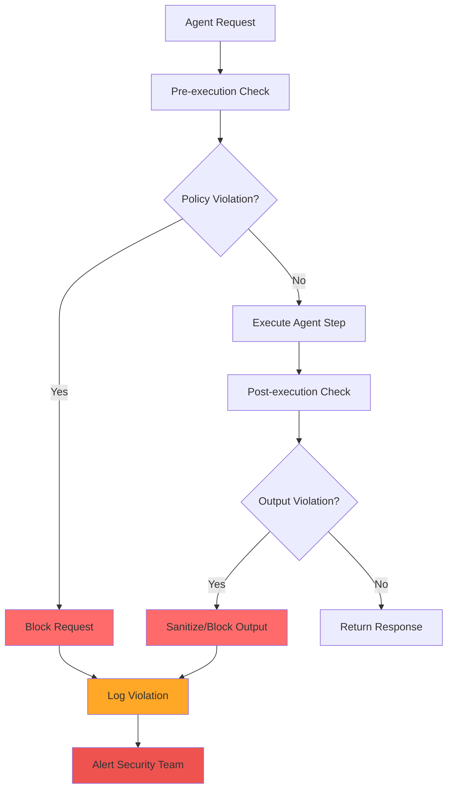
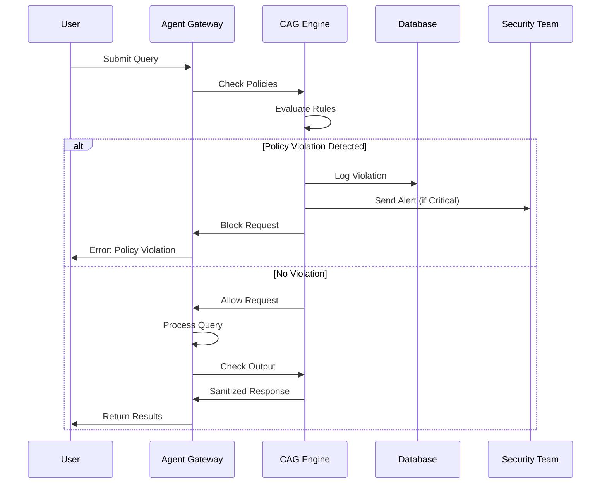

# Context-Aware Guardrails (CAG) Policies

## Overview

Context-Aware Guardrails (CAG) provide runtime policy enforcement for SCIRM's AI agent swarm, ensuring safe, compliant, and contextually appropriate outputs. This document defines the core policies, enforcement mechanisms, and violation handling procedures.

## Policy Framework

### Policy Types

| Policy Type | Purpose | Enforcement Point | Severity |
|-------------|---------|-------------------|----------|
| PII Protection | Prevent sensitive data exposure | Agent output | Critical |
| Vendor Compliance | Enforce approved supplier lists | Agent recommendations | High |
| Cost Control | Limit resource consumption | Agent execution | Medium |
| Confidence Threshold | Ensure output reliability | Agent response | High |
| Content Safety | Block harmful content | Agent input/output | Critical |

### Policy Enforcement Flow



## Core Policies

### 1. PII Protection Policy

**Purpose**: Prevent exposure of personally identifiable information in agent outputs.

**Policy Rules**:
```json
{
  "policy_name": "pii_protection",
  "policy_type": "content_filter",
  "rules": {
    "patterns": [
      "\\b\\d{3}-\\d{2}-\\d{4}\\b",
      "\\b[A-Za-z0-9._%+-]+@[A-Za-z0-9.-]+\\.[A-Z|a-z]{2,}\\b",
      "\\b\\d{4}[\\s-]?\\d{4}[\\s-]?\\d{4}[\\s-]?\\d{4}\\b"
    ],
    "action": "redact",
    "replacement": "[REDACTED]"
  },
  "severity": "critical"
}
```

**Enforcement**: Real-time scanning of agent outputs using regex patterns and ML-based PII detection.

### 2. Vendor Compliance Policy

**Purpose**: Ensure agent recommendations only include pre-approved suppliers.

**Policy Rules**:
```json
{
  "policy_name": "vendor_compliance",
  "policy_type": "business_rule",
  "rules": {
    "approved_vendors_only": true,
    "vendor_risk_threshold": 75,
    "restricted_countries": ["Country1", "Country2"],
    "action": "block_recommendation"
  },
  "severity": "high"
}
```

**Enforcement**: Cross-reference supplier recommendations against approved vendor database.

### 3. Cost Control Policy

**Purpose**: Prevent excessive resource consumption by AI agents.

**Policy Rules**:
```json
{
  "policy_name": "cost_control",
  "policy_type": "resource_limit",
  "rules": {
    "max_tokens_per_request": 4000,
    "max_cost_per_hour_usd": 10.00,
    "max_concurrent_requests": 50,
    "action": "throttle"
  },
  "severity": "medium"
}
```

**Enforcement**: Real-time monitoring of token usage and cost accumulation.

### 4. Confidence Threshold Policy

**Purpose**: Ensure agent outputs meet minimum confidence requirements.

**Policy Rules**:
```json
{
  "policy_name": "confidence_threshold",
  "policy_type": "quality_gate",
  "rules": {
    "min_confidence_score": 0.7,
    "require_citations": true,
    "min_citation_count": 2,
    "action": "flag_low_confidence"
  },
  "severity": "high"
}
```

**Enforcement**: Validate confidence scores and citation quality before output delivery.

### 5. Content Safety Policy

**Purpose**: Block harmful, inappropriate, or dangerous content.

**Policy Rules**:
```json
{
  "policy_name": "content_safety",
  "policy_type": "content_filter",
  "rules": {
    "blocked_categories": [
      "violence",
      "hate_speech",
      "illegal_activities",
      "misinformation"
    ],
    "toxicity_threshold": 0.8,
    "action": "block_and_alert"
  },
  "severity": "critical"
}
```

**Enforcement**: ML-based content classification and toxicity scoring.

## Policy Mapping Matrix

| Agent Type | PII Protection | Vendor Compliance | Cost Control | Confidence Threshold | Content Safety |
|------------|----------------|-------------------|--------------|---------------------|----------------|
| Coordinator | ✅ | ✅ | ✅ | ✅ | ✅ |
| Planner | ✅ | ✅ | ✅ | ✅ | ✅ |
| Researcher | ✅ | ❌ | ✅ | ✅ | ✅ |
| Executor | ✅ | ✅ | ✅ | ✅ | ✅ |
| Reviewer | ✅ | ✅ | ❌ | ✅ | ✅ |

**Legend**: ✅ = Policy Applied, ❌ = Policy Not Applied

## Violation Handling

### Severity Levels

| Severity | Response Time | Action | Escalation |
|----------|---------------|--------|------------|
| Critical | Immediate | Block + Alert | Security Team |
| High | < 5 minutes | Block + Log | Team Lead |
| Medium | < 15 minutes | Throttle + Log | Next Business Day |
| Low | < 1 hour | Log Only | Weekly Review |

### Blocked Request Flow



## Implementation Details

### Policy Engine Architecture

```
┌─────────────────────────────────────────────────────────┐
│ CAG Policy Engine                                       │
├─────────────────────────────────────────────────────────┤
│ ┌─────────────┐ ┌─────────────┐ ┌─────────────┐        │
│ │ Rule Engine │ │ ML Detector │ │ Pattern     │        │
│ │             │ │             │ │ Matcher     │        │
│ └─────────────┘ └─────────────┘ └─────────────┘        │
├─────────────────────────────────────────────────────────┤
│ ┌─────────────┐ ┌─────────────┐ ┌─────────────┐        │
│ │ Violation   │ │ Alert       │ │ Audit       │        │
│ │ Logger      │ │ Manager     │ │ Trail       │        │
│ └─────────────┘ └─────────────┘ └─────────────┘        │
└─────────────────────────────────────────────────────────┘
```

### Database Schema Integration

```sql
-- Policy evaluation results
CREATE TABLE policy_evaluation (
    evaluation_id UUID PRIMARY KEY DEFAULT gen_random_uuid(),
    agent_run_id UUID NOT NULL REFERENCES agent_run(run_id),
    policy_id UUID NOT NULL REFERENCES cag_policy(policy_id),
    evaluation_result VARCHAR(20) NOT NULL, -- 'pass', 'fail', 'warning'
    confidence_score DECIMAL(5,4),
    evaluation_details JSONB,
    evaluation_time_ms INTEGER,
    evaluated_at TIMESTAMPTZ DEFAULT NOW()
);

-- Real-time policy cache
CREATE TABLE policy_cache (
    cache_key VARCHAR(255) PRIMARY KEY,
    policy_data JSONB NOT NULL,
    expires_at TIMESTAMPTZ NOT NULL,
    created_at TIMESTAMPTZ DEFAULT NOW()
);
```

## Monitoring & Alerting

### Key Metrics

| Metric | Target | Alert Threshold | Description |
|--------|--------|-----------------|-------------|
| Policy Evaluation Latency | < 25ms | > 100ms | Time to evaluate all policies |
| Violation Rate | < 0.1% | > 1% | Percentage of requests blocked |
| False Positive Rate | < 5% | > 10% | Incorrectly blocked requests |
| Policy Coverage | 100% | < 95% | Requests with policy evaluation |

### Alert Configuration

```yaml
# Prometheus alerting rules
groups:
  - name: cag_policies
    rules:
      - alert: HighViolationRate
        expr: rate(cag_violations_total[5m]) > 0.01
        for: 2m
        labels:
          severity: warning
        annotations:
          summary: "High CAG policy violation rate detected"
          
      - alert: CriticalPolicyViolation
        expr: increase(cag_violations_total{severity="critical"}[1m]) > 0
        for: 0s
        labels:
          severity: critical
        annotations:
          summary: "Critical CAG policy violation detected"
```

## Testing & Validation

### Red Team Scenarios

| Scenario | Expected Outcome | Test Frequency |
|----------|------------------|----------------|
| PII Injection | Block and redact | Weekly |
| Unapproved Vendor | Block recommendation | Weekly |
| Cost Bomb Attack | Throttle requests | Monthly |
| Low Confidence Output | Flag for review | Daily |
| Toxic Content | Block and alert | Daily |

### Policy Testing Framework

```python
# Example policy test
def test_pii_protection_policy():
    test_input = "Contact John Doe at john.doe@example.com or 123-45-6789"
    expected_output = "Contact John Doe at [REDACTED] or [REDACTED]"
    
    result = cag_engine.evaluate_policy(
        policy_name="pii_protection",
        content=test_input
    )
    
    assert result.action == "redact"
    assert result.sanitized_content == expected_output
    assert result.violation_count == 2
```

## Compliance & Audit

### Regulatory Alignment

| Regulation | Relevant Policies | Compliance Status |
|------------|-------------------|-------------------|
| GDPR | PII Protection | ✅ Compliant |
| SOC 2 | All Policies | ✅ Compliant |
| HIPAA | PII Protection, Content Safety | ✅ Compliant |
| FDA 21 CFR Part 11 | Confidence Threshold, Audit Trail | ✅ Compliant |

### Audit Trail Requirements

```sql
-- Comprehensive audit logging
CREATE VIEW cag_audit_trail AS
SELECT 
    v.violation_id,
    v.detected_at,
    p.policy_name,
    p.policy_type,
    v.severity,
    v.action_taken,
    ar.agent_type,
    ar.org_id,
    v.violation_details
FROM cag_violation v
JOIN cag_policy p ON v.policy_id = p.policy_id
JOIN agent_run ar ON v.agent_run_id = ar.run_id
ORDER BY v.detected_at DESC;
```

---

**Related Documentation:**
- [Database Architecture](../architecture/database.md)
- [Agent Sequences](../architecture/agent-sequences.md)
- [Security Overview](security-overview.md)
- [ADR-005: CAG Policy Framework](../architecture/adr/ADR-005-cag-policy-framework.md)
