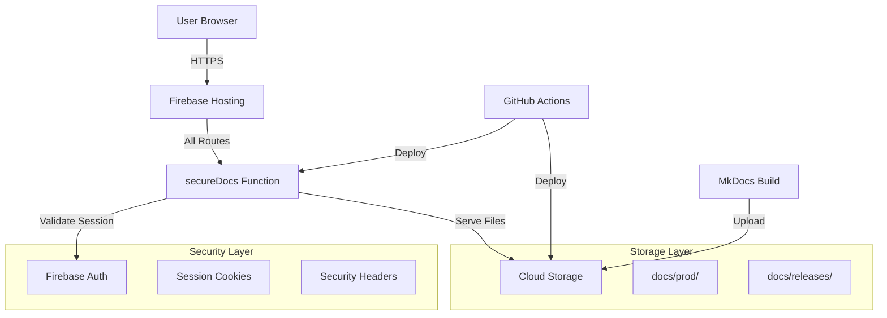

# SCIRM Firebase Documentation Platform

🔒 **Secure, Auth-Gated Documentation Platform for SCIRM AI Supply Chain Risk Management**

## 🏗️ Architecture Overview



## 🔐 Security Features

- **🛡️ No Anonymous Access**: All routes require Google OAuth authentication
- **🍪 Session Cookies**: HTTP-only, secure cookies with 5-day expiry
- **🔒 Security Headers**: HSTS, XFO DENY, XCTO nosniff, CSP enforced
- **☁️ Storage Rules**: Authenticated read-only, CI/CD write-only
- **📊 Audit Logging**: All requests logged for compliance

## 🚀 Deployment Process

### 1. Prerequisites
```bash
# Required GitHub Secrets
FIREBASE_SERVICE_ACCOUNT_KEY  # Service account JSON
FIREBASE_PROJECT_ID          # Firebase project ID (or use vars)
```

### 2. Branch Strategy
- **`main`**: Production deployments only
- **`firebase-setup`**: Infrastructure scaffolding (this branch)
- **`internal-dashboards`**: Internal governance dashboards (never deployed)

### 3. Deployment Flow
```bash
# Automatic deployment on main branch
git push origin main
# Triggers: ci-docs.yml → deploy-firebase.yml
```

## 📁 Directory Structure

```
firebase/
├── .firebaserc                 # Project configuration
├── firebase.json              # Hosting & Functions config
├── storage.rules              # Cloud Storage security rules
├── functions/                 # Cloud Functions (Node.js 20)
│   ├── package.json
│   ├── tsconfig.json
│   ├── .eslintrc.js
│   └── src/
│       └── index.ts          # secureDocs function
└── hosting/                  # Static hosting files
    ├── login.html           # Authentication page
    └── js/
        └── auth.js          # Firebase Auth integration
```

## 🔧 Local Development

### Setup
```bash
# Install Firebase CLI
npm install -g firebase-tools

# Login to Firebase
firebase login

# Install function dependencies
cd firebase/functions
npm install

# Start emulators
firebase emulators:start
```

### Testing
```bash
# Build functions
npm run build

# Run linting
npm run lint

# Deploy to staging (if configured)
firebase deploy --project staging
```

## 🛡️ Security Configuration

### Authentication Flow
1. User visits any route → redirected to `/login`
2. Google OAuth sign-in → ID token received
3. ID token exchanged for session cookie via `/auth/callback`
4. Session cookie validates all subsequent requests
5. Invalid/expired sessions → redirect to `/login`

### Security Headers
```javascript
// Enforced on all responses
"Strict-Transport-Security": "max-age=31536000; includeSubDomains; preload"
"X-Frame-Options": "DENY"
"X-Content-Type-Options": "nosniff"
"Content-Security-Policy": "default-src 'self'; script-src 'self' 'unsafe-inline' https://www.gstatic.com https://apis.google.com"
```

### Storage Security
```javascript
// storage.rules - Authenticated read-only access
match /docs/{allPaths=**} {
  allow read: if request.auth != null;
  allow write: if false; // CI/CD only
}
```

## 📊 Monitoring & Compliance

### Audit Logging
Every request logged with:
- Request ID, timestamp, IP address
- User email (if authenticated)
- Requested path and method
- Response status and duration

### Evidence Capture
Deployment evidence automatically captured:
- `compliance/artifacts/YYYY-MM-DD-HHMM/firebase-deploy.json`
- Security controls validation
- Deployment success/failure status

## 🚨 Troubleshooting

### Common Issues

#### Authentication Failures
```bash
# Check session cookie
curl -H "Cookie: __session=<cookie>" https://your-app.web.app/

# Verify Firebase Auth configuration
firebase auth:export users.json --project your-project
```

#### Function Errors
```bash
# View function logs
firebase functions:log --project your-project

# Debug locally
firebase emulators:start --inspect-functions
```

#### Storage Access Issues
```bash
# Test storage rules
firebase emulators:start --only storage
# Use Firebase console to test rules
```

### Health Checks
```bash
# Site accessibility (should return 200 or 302)
curl -I https://your-app.web.app/

# Function health
curl https://your-app.web.app/health

# Storage connectivity
gsutil ls gs://your-bucket/docs/prod/
```

## 🔄 Updates & Maintenance

### Function Updates
```bash
cd firebase/functions
npm update
npm audit fix
firebase deploy --only functions
```

### Security Updates
- Monitor Firebase security advisories
- Update Node.js runtime when available
- Review and update dependencies monthly
- Test security headers quarterly

### Backup & Recovery
- Documentation automatically versioned in Cloud Storage
- Function code versioned in Git
- Configuration backed up in repository
- Recovery time objective: < 1 hour

## 📋 Compliance Checklist

- ✅ Authentication required for all access
- ✅ Session management with secure cookies
- ✅ Security headers enforced
- ✅ Audit logging enabled
- ✅ Evidence capture automated
- ✅ Storage access controls configured
- ✅ No hardcoded secrets
- ✅ HTTPS enforced with HSTS
- ✅ Content Security Policy active
- ✅ Regular security updates scheduled

## 🆘 Support

- **Documentation**: `/docs/` in this repository
- **Security Issues**: `security@scirm.ai`
- **Technical Support**: Create GitHub issue
- **Emergency**: Follow incident response procedures

---

🔒 **This Firebase platform enforces zero-trust security with comprehensive audit trails for enterprise compliance.**
